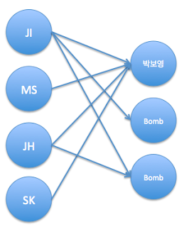
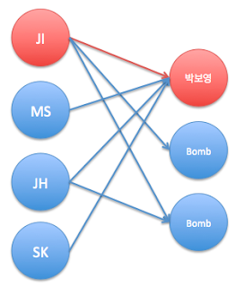
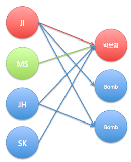
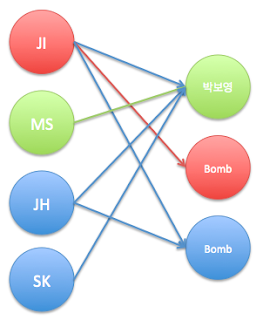
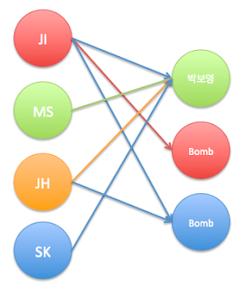
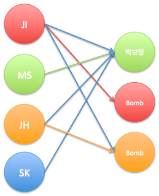
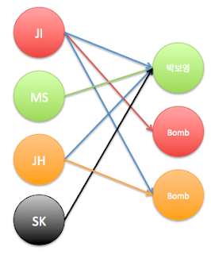
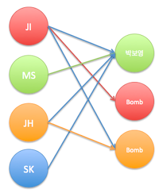

## Description

Bipartite Matching를 알기 위해서는 Bipartite Graph를 먼저 알아야 한다. Bipartite Graph란 이분 그래프로써 그래프에 있는 모든 정점들을 두 그룹으로 나누었을 때, 모든 간선이 서로를 이어주기만 하는 분할이 존재하는 그래프를 말한다. 모든 이분 그래프의 간선의 $Capacity$가 1로 주어졌을 때, 두 그룹의 최대 매칭 수를 구하는 문제가 Bipartite Matcing문제이다.
이분 매칭 문제이 무엇인지 예를 들어서 이해해 보자.어느 대학교 신입생 남자 네명이 미팅을 나갔는데, 상대편이 세 명밖에 나오지 않았다. 그 와중에 상대편에 박보영이 있어서 미팅을 파토내지 않기로 했는데, 남자 네명의 선호도가 모두 달랐고 선호도는 밑의 그래프로 나타낼 수 있었다. 이 때, 선호도에 따른 최대 파트너를 고르를 수 있는 경우의 수를 세는 문제이다.



모든 남자들이 순서대로 $DFS$를 돌면서 선택할 수 있는 파트너를 먼저 선택한다.




그런데 위와 같이 앞선 남자애가 먼저 선택을 했다면 먼저 선택한 남자애가 선호하는 다른애가 있는지를 확인하고, 만약 있다면 현재 남자애가 박보영을 선택하고, 먼저 선호한 남자는 다른 선호하는 여자를 선택한다.




JH의 차례가 왔는데 JH가 선호하는 박보영을 먼저 선택한 남자가 굉장히 지조있는 아이여서 다른 선호하는 여자가 없을 경우, 선택의 여지가 없이 JH는 여분의 선호하는 여자를 선택하게 된다.




그리고 마지막 기회를 가진 SK는 먼저 선택한 남자들이 모두 파트너를 정했으므로 선택권이 없이 이 미팅에서 방출되게 된다.
(ㅠㅠㅠㅠㅠㅠㅠㅠㅠㅠㅠㅠㅠㅠㅠㅠㅠ)



따라서 최종적으로 연결된 파트너는 위와 같은 세 커플이 되고, 최대 매칭을 구하게 된다.<br>
이와 같은 문제를 이분 매칭이라고 하고, 눈에 띄는 이분 매칭 뿐만이 아니라 여러 문제에서 그래프로 모델링을 한 다음 매칭으로 풀 수 있는 문제가 굉장히 많다.<br>
이러한 이분 매칭을 푸는 알고리즘으로는 EdmondKarp, FordFulkerson, Dinic, HopcroftKarp Algorithm등이 있고, 이 중 가장 빠른 알고리즘은 HopcroftKarp Algorithm이다.<br>
특정 알고리즘을 이용하는 것이 아니라, 가장 쉽게 생각할 수 있는 알고리즘은 단순히 $DFS$를 돌리는 방법이다. 이분 매칭은 모든 $Capacity$가 1이기 때문에, 가능한 모든 매칭을 찾아주면 최대 이분 매칭을 구할 수 있다. 위의 예제가 딱 $DFS$로 구한 매칭이다.

```cpp
#include <cstdio>
#include <cstring>
#include <vector>
#include <algorithm>
using namespace std;
#define MAX_V 1000
vector<vector<int> > v;
int backMatch[MAX_V*2+5];
bool visited[MAX_V*2+5];
bool dfs(int now) {
    if ( visited[now] ) return false;
    visited[now] = true;
    for ( int i = 0 ; i < v[now].size() ; i++ ) {
        int next = v[now][i];
        if ( backMatch[next] == -1 || dfs(backMatch[next]) ) {
            backMatch[next] = now;
            return true;
        }
    }
    return false;
}
int BipartiteMatching() {
    memset(backMatch,-1,sizeof(backMatch));
    int matched =0;
    for ( int i = 0 ; i < v.size() ; i++ ) {
        memset(visited,false,sizeof(visited));
        if ( dfs(i) ) matched++;
    }
    return matched;
}
```

EdmondKarp와 Ford Fulkerson은 Maximum Flow를 이용한 알고리즘인데, EdmondKarp Algorithm은 확장 경로를 찾는데 O($V*E$)의 시간이 걸리고 총 O($V*E^2$)의 시간복잡도를 갖고, FordFulkerson Algorithm은 O($E*flow$)의 시간복잡도를 갖는다.<br>
둘이 다른점은 크게 EdmondKarp는 $BFS$, FordFulkerson은 $DFS$로 확장경로를 찾음을 보면 탐색 방법이 다름을 알 수 있다. EdmondKarp는 이전 게시물의 Maximum Flow 쪽을 읽어보면 알 수 있다. 하지만 위의 $DFS$로 구하는게 평균적으로 더 빠르다고 알려져 있다.<br>
기본적인 이분 매칭에서 가장 빠른 알고리즘은 HopcroftKarp Algorithm인데, 내용 자체는 쉬우나 시간복잡도를 분석하기 힘들어서 잘 알려지지 않은 알고리즘이라고 한다. 이 알고리즘은 최악의 경우 $O(E*sqrt(V))$의 시간을 갖고, 빡빡한 그래프에서는 $O(V^{2.5})$, 랜덤 그래프에서는 선형의 시간을 갖는다.<br>

To be Continued...


```cpp
#include <cstdio>
#include <queue>
#include <vector>
#include <algorithm>
using namespace std;
#define MAX_V 1004
const int inf = 987654321;
int N,M;
int used[MAX_V],match[MAX_V],d[MAX_V];
vector<vector<int> > v;
queue<int> q;
void bfs() {
    for ( int i = 1 ; i <= N ; i++ ) 
        d[i] = inf;
    for ( int i = 1 ; i <= N ; i++ ) 
        if ( !used[i] ) d[i] =0,q.push(i);
    while ( !q.empty() ) {
        int now = q.front();q.pop();
        for ( int i = v[now].size() ; i-- ; ) {
            int next = v[now][i];
            if ( match[next] && d[match[next]] == inf )
                d[match[next]] = d[now]+1,q.push(match[next]);
        }
    }
}
bool dfs(int now) {
    for ( int i = v[now].size() ; i-- ; ) {
        int next = v[now][i];
        if ( !match[next] || d[match[next]] == d[now]+1 && dfs(match[next]) ) {
            used[now] = true, match[next] = now;
            return true;
        }
    }
    return false;
}
int matching() {
    int ret=0;
    while ( true ) {
        bfs();
        int flow=0;
        for ( int i = 1 ; i<= N ; i++ )
            if ( !used[i] && dfs(i) ) flow++;
        ret += flow;
        if ( !flow ) break;
    }
    return ret;
}

#include <stdio.h>
#include <numeric>
#include <climits>
#include <algorithm>
#include <vector>
#include <memory.h>
 
using namespace std;
 
int n;
 
// in: n, m, graph
// out: match
namespace HopcroftKarp
{
    const int MAX_N = 503, MAX_M = 503;
    int n, m;
    vector<int> graph[MAX_N];
    int match[MAX_N];
 
    int matched[MAX_M], depth[MAX_N], q[MAX_N];
    int v[MAX_N], vcnt;
    bool BFS(){
        int t = 0;
        for(int i = 0; i < n; i++)
            if (match[i] == -1) depth[i] = 0, q[t++] = i;
            else depth[i] = -1;
        for(int h = 0; h < t; h++) {
            int cur = q[h];
            int curDepth = depth[cur];
            for(int i = 0; i < graph[cur].size(); i++) {
                int adj = graph[cur][i];
                if (matched[adj] == -1)
                    return true;
                int next = matched[adj];
                if (depth[next] != -1) continue;
                depth[next] = curDepth + 1, q[t++] = next;
            }
        }
        return false;
    }
 
    bool DFS(int nod) {
        v[nod] = vcnt;
        for(int i = 0; i < graph[nod].size(); i++) {
            int adj = graph[nod][i];
            int next = matched[adj];
            if (next >= 0 && (v[next] == vcnt || depth[next] != depth[nod] + 1))
                continue;
            if (next == -1 || DFS(next)) {
                match[nod] = adj;
                matched[adj] = nod;
                return true;
            }
        }
        return false;
    }
 
    int Match()
    {
        memset(match, -1, sizeof(match));
        memset(matched, -1, sizeof(matched));
        int ans = 0;
        while(BFS()) {
            ++vcnt;
            for(int i = 0; i < n; i++) if (depth[i] == 0 && DFS(i)) ans++;
        }
        return ans;
    }
}
 
int vx[503], vy[503];
 
int main(){
    scanf("%d",&n);
    for(int i = 0; i < n; i++) {
        int a,b;
        scanf("%d%d",&a,&b);
        a--,b--;
        vx[a] = 1, vy[b] = 1;
        HopcroftKarp::graph[a].push_back(b);
    }
    HopcroftKarp::n = HopcroftKarp::m = 500;
    int cLeft = accumulate(vx, vx+500, 0), cRight = accumulate(vy, vy+500, 0);
    puts(cLeft + cRight == 2 * HopcroftKarp::Match() ? "Slavko" : "Mirko");
    return 0;
}
```