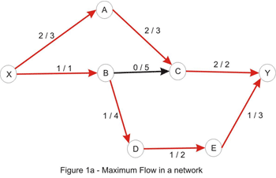

## Description

Network flow에서 최대 유량을 찾는 알고리즘이 Maximum Flow이다. 네트워크(그래프)가 주어지고 이 그래프는 각 간선에 흐를 수 있는 최대 유량이 주어지는데, 이를 Capacity라 하자. 아래 그림은 Source에서 Sink까지 흐를 수 있는 최대 유량을 보여준다. 여기서 Source는 물을 흘려주는 시작점을 뜻하고(X에 해당), Sink는 물이 최종적으로 도착하는 도착점을 뜻한다(Y에 해당).<br>
<br>



<br>
이 문제를 해결하는 방법은 간단하다. 먼저 아래와 같이 정의해보자.<br>
<br>

* Parent[node]: node에 흐르기 바로직전 노드를 가르킨다.
* Flow[nodeX][nodeY]: nodeX에서 nodeY로 흐른 유량을 나타낸다.

<br>
그 다음, Source에서 DFS나 BFS를 돌면서 Sink까지 이어지는 경로를 찾는다. 경로를 찾을 때, Capacity를 넘는 유량을 보낼 수는 없으므로 가능한 경우(Capacity[][]-Flow[][])만 경로로 생각한다.<br>
Sink로 이어지는 가능한 경로를 찾았다면, 그 경로의 간선에는 유량이 흐를 수가 있는 경우이므로 가능한 경로의 공통 흐를 수 있는 용량 (Capacity[][]-Flow[][])만큼을 흘려준다.<br>
이 때, 지나온 경로를 탐색해야 하므로 맨 처음 BFS나 DFS로 경로를 찾으면서 Parent[]배열을 구성해 주어야 한다. 이렇게 가능한 경로에 가능한 유량을 흘려주면서 더이상 업데이트가 없을 때 종료시켜주면, 현재 흐른 유량이 Maximum Flow가 된다.<br>

```cpp
const int INF=987654321;
int V;
 
int capacity[MAX_V][MAX_V], flow[MAX_V][MAX_V];
 
int nf(int source, int sink) {
 memset(flow, 0, sizeof(flow));
 int totalFlow=0;
 while(true) {
  vector < int > parent(MAX_V, -1);
  queue <int> q;
  parent[source]=source;
  q.push(source);
  while(!q.empty()) {
   int here=q.front(); q.pop();
   for(int there=0; there<V; ++there)
    if(capacity[here][there]-flow[here][there]>0 && parent[there]==-1) {
     q.push(there);
     parent[there]=here;
    }
  }
 
  if(parent[sink]==-1) break;
  int amount=INF;
  for(int p=sink; p!=source; p=parent[p])
   amount=min(capacity[parent[p]][p]-flow[parent[p]][p],amount);
  for(int p=sink; p!=source; p=parent[p]) {
   flow[parent[p]][p]+=amount;
   flow[p][parent[p]]-=amount;
  }
  totalFlow+=amount;
 }
 return totalFlow;
}
// code by JM BOOK
```

> 매칭으로 이어짐
