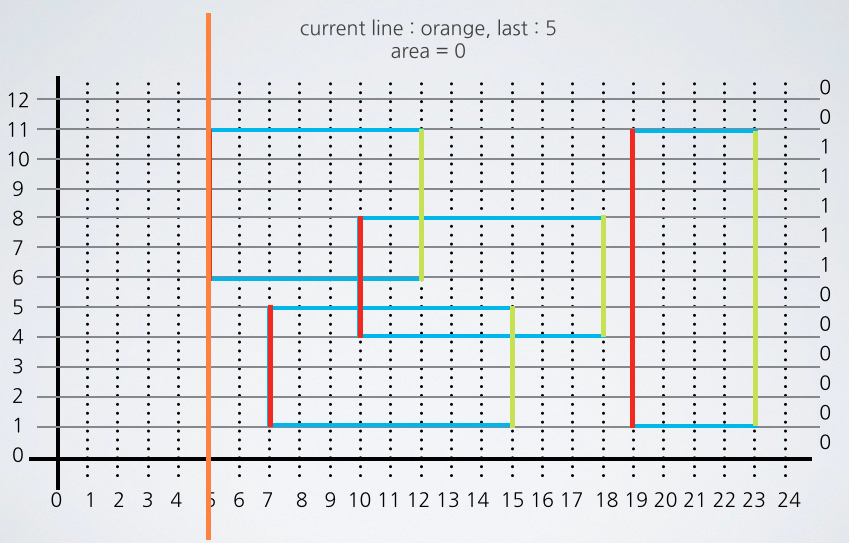

* [BOJ 2669 직사각형 네 개의 합집합의 면적 구하기](http://acmicpc.net/problem/2669)
* [BOJ 2672 여러 직사각형의 전체 면적 구하기](http://acmicpc.net/problem/2672)
* [BOJ 3392 화성 지도](http://acmicpc.net/problem/3392)

## 문제요약

$2$차원 평면상에 $x$축과 $y$축에 평행하게 직사각형들이 주어지면 그 직사각형들의 전체 면적을 구하는 문제이다. 직사각형이 겹칠 경우에는 한번만 면적을 구해야 한다. 맨 위의 문제는 $N$제한이 4이고 좌표들도 정수형인데 제한도 작아서 가장 쉬운문제이다. 가운데의 문제는 $N$제한이 30이지만 $x$, $y$좌표가 실수이고, 아래 문제는 좌표가 정수인 반면에 $N$ 제한이 $10,000$이다. 

## 해법

BOJ 2669 같은 경우에는 직사각형에 포함되는지 아닌지를 2차원 배열에 저장해 둘 수 있을 정도로 $x$, $y$의 제한이 작다. 따라서 bool rec[111][111] 정도로 잡아서 Flood Fill 로 해결하면 된다. 시간 복잡도는 $O(N*W*H)$ 이다. 


```cpp
#include <cstdio>
#include <algorithm>
using namespace std;
int d[111][111];
int main() {
//  freopen("input.txt","r",stdin);
    for ( int i = 0 ; i < 4 ; i++ ) {
        int x1,y1,x2,y2;
        scanf("%d%d%d%d",&x1,&y1,&x2,&y2);
        for ( int j = x1 ; j < x2 ; j++ )
            for ( int k = y1 ; k < y2 ; k++ )
                d[j][k]++;
    }
    int ans =0;
    for ( int i = 0 ; i < 111 ; i ++ )
        for ( int j = 0 ; j < 111; j ++ )
            if ( d[i][j] ) ans++;
    printf("%d\n",ans);
    return 0;
}
```


BOJ 2672 같은 경우에는 좌표들이 실수형이기 때문에 위와 같은 방식으로 해결할 수 없다. 그래서 다른 방법을 생각해야 하는데, $N$제한이 30정도로 굉장히 작으므로 $O(N^5)$ 까지도 가능하다. 따라서 가장 쉽게 생각할 수 있는 Brute Force 방법으로 다 돌려보면 된다. 현재 주어진 직사각형들의 $x$, $y$ 좌표들을 따로 저장해둔 다음, 그 $x$, $y$좌표들로 만들 수 있는 모든 직사각형을 만들면서 만든 직사각형이 주어진 직사각형들 안에 포함되면 넓이를 계산해 주면 된다. 시간 복잡도는 $O(N^3)$.


```cpp
#include <cstdio>
#include <cstring>
#include <algorithm>
#include <vector>
using namespace std;
struct Rec{
    double x1,y1,x2,y2;
    Rec(){}
    Rec(double _x1,double _y1,double _x2,double _y2):
        x1 (_x1),y1 (_y1),x2 (_x2),y2 (_y2) {}
};
int N;
bool ok(Rec a,Rec b) {
    return a.x1 < b.x2 && a.x2 > b.x1 && a.y1 < b.y2 && a.y2 > b.y1;
}
int main() {
    vector<rec> v;
    vector<double> x,y;
    scanf("%d",&N);
    for ( int i = 0 ; i < N ; i++ ) {
        double xx,yy,width,height;
        scanf("%lf%lf%lf%lf",&xx,&yy,&width,&height);
        v.push_back(Rec(xx,yy,xx+width,yy+height));
        x.push_back(xx);x.push_back(xx+width);
        y.push_back(yy);y.push_back(yy+height);
    }
    sort(x.begin(),x.end());
    sort(y.begin(),y.end());
    double ans=0;
    for ( int i = 0 ; i < (int)x.size() ; i++ )
        for ( int j = 0 ; j < (int)y.size() ; j++ )
            for ( int k = 0 ; k < (int)v.size() ; k++ )
                if ( ok(Rec(x[i],y[j],x[i+1],y[j+1]),v[k]) ) {
                    ans += (x[i+1]-x[i])*(y[j+1]-y[j]);
                    break;
                }
    if ( ans-(long long)ans < 1e-3 ) return printf("%lld\n",(long long)ans);
    printf("%.2lf\n",ans);
    return 0;
}
```


BOJ 3392 의 문제는 $N$이 상당히 크므로 다 돌리는 방식으로는 해결 할 수 없다. 이럴 때 Plane Sweeping 에 구간 트리를 이용해서 $O(N^3)$ 에서 $O(N log N)$으로 줄일 수가 있다. 

먼저 직사각형들을 시작점과 끝점을 표시한다. 그리고 y축의 좌표들이 인덱스 트리의 구간이 된다. 직사각형의 모든 x 좌표를 돌면서 

1. 시작점일 때에는 현재 직사각형의 y좌표 구간을 인덱스 트리에 1 증가시켜 준다. 그리고 이전에 들렸던 x좌표에서 현재 x좌표까지의 너비와 인덱스 트리의 구간에서의 개수를 곱해서 넓이를 계산한다. 
2. 직사각형의 끝점일 때에는 현재 직사각형의 y좌표 구간을 인덱스 트리에 1씩 감소시켜 주고, 시작점일 때와 마찬가지로 넓이를 계산해주면 총 합집합의 넓이를 구할 수 있다. 이 때 2*N 만큼의 x 좌표를 방문하고, 각 방문 시 log N만큼의 구간 업데이트가 있으므로 총 시간복잡도는 $O(N log N)$ 이다.


직사각형들이 주어진다.<br><br>

직사각형의 시작점과 끝점을 표시해준다. 빨간색이 시작점이고, 끝점이 노란색으로 표시했다.<br><br>

Y좌표는 인덱스 트리의 구간이 된다.<br><br>

X좌표를 기준으로 주황색 선이 Sweeping을 하는데, 먼저 이전에 방문했던 x좌표와 현재 x좌표를 너비로 하는 넓이를 계산해 준다. 지금은 처음 방문이므로 0이다.<br><br>

직사각형의 시작변이므로 인덱스 트리의 구간을 1로 셋팅해준다.<br><br>

다음으로 넘어와서도 시작 변이므로 위와 같은 작업을 한다.<br><br>


처음으로 직사각형의 끝점이 나왔다. 마찬가지로 넓이를 먼저 계산하고.<br><br>

인덱스 트리의 구간을 1 감소시켜준다.<br><br>

아래부터는 위와 같다.<br><br>


```cpp
#include <cstdio>
#include <cstring>
#include <vector>
#include <algorithm>
using namespace std;
int N;
struct Rec{
    int x,y1,y2,end;
    Rec() {}
    Rec(int _x,int _y1,int _y2,int _end):
        x (_x), y1 (_y1), y2 (_y2), end (_end){}
    bool operator < (const Rec r) const {
        return x != r.x ? x < r.x : end > r.end;
    }
};
/*
int dataMul[65536],dataAdd[65536];
void internalUpdate(int at, int mul, int add) {
    while (at < 65536) {
        dataMul[at] += mul;
        dataAdd[at] += add;
        at |= (at + 1);
    }
}
void update(int left, int right, int by) {
    internalUpdate(left, by, -by * (left - 1));
    internalUpdate(right, -by, by * right);
}
int query(int at) {
    int mul = 0;
    int add = 0;
    int start = at;
    while (at >= 0) {
        mul += dataMul[at];
        add += dataAdd[at];
        at = (at & (at + 1)) - 1;
    }
    return mul * start + add;
}
*/
int tree[65538],cnt[65538];
void update(int x,int left,int right,int nodeLeft,int nodeRight,int val) {
    if ( left > nodeRight || right < nodeLeft ) return;
    if ( left <= nodeLeft && right >= nodeRight ) cnt[x] += val;
    else {
        int mid = (nodeLeft+nodeRight)>>1;
        update(x*2,left,right,nodeLeft,mid,val);
        update(x*2+1,left,right,mid+1,nodeRight,val);
    }
    tree[x] = 0;
    if ( cnt[x] > 0 ) tree[x] = nodeRight-nodeLeft+1;
    if ( cnt[x] == 0 && nodeLeft < nodeRight ) tree[x] = tree[x*2]+tree[x*2+1];
}
int main() {
    scanf("%d",&N);
    vector<Rec> v;
    for ( int i = 0 ; i < N ; i++ ) {
        int x1,y1,x2,y2;
        scanf("%d%d%d%d",&x1,&y1,&x2,&y2);
        v.push_back(Rec(x1,y1,y2,1));
        v.push_back(Rec(x2,y1,y2,-1));
    }
    sort(v.begin(),v.end());
    int px = v[0].x;
    int ans=0;
    for ( int i = 0 ; i < (int)v.size() ; i++ ) {
        /*
        ans += (v[i].x-px)*(query(65535)-query(1));
        update(v[i].y1,v[i].y2-1,v[i].end);
        px = v[i].x;
        */
        ans += (v[i].x-px)*tree[1];
        update(1,v[i].y1,v[i].y2-1,0,32768,v[i].end);
        px = v[i].x;
    }
    printf("%d\n",ans);
    return 0;
}
```

>인덱스 트리를 이용할 때, 구간 업데이트가 되는 Petr느님의 펜윅트리 구간업데이트 가능 버전을 써봤지만 중복된 걸 찾기가 힘들어서 그냥 구간 트리를 짰다. ㅎ_ㅎ
