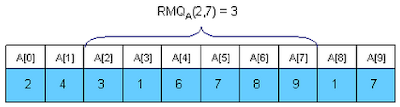
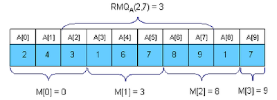
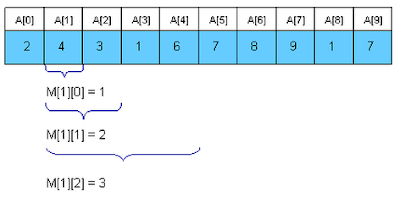
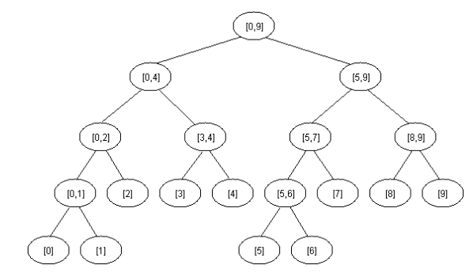

## Description

문제를 풀다보면 구간의 최대값 혹은 최소값, 구간합 등을 구하는 문제들이 상당히 많다. 그런 문제들 중, Query
가 많은 문제들을 풀기 위해서는 미리 답을 저장해 놓거나 빠른 시간내에 구간을 탐색할 수 있는 자료구조를 이용해야 효율적으로 해결할 수 있다. 따라서 이러한 문제를 해결할 수 있는 여러가지 알고리즘들을 분석해본다. 
분석하기에 앞서서 <O(PreprocessingTime), O(QueryTime)>로 정의하자.

#### <O($N^2$), O($1)> DP Solution



$RMQ$를 구하는데 가장 쉽게 생각할 수 있는 Solution은 Dynamic Programming이다.<br>
$d[i][j]$를 $i$에서 $j$까지의 최소값이 있는 인덱스라고 하면<br>
$d[i][j] = min(a[d[i][j-1]],a[j])$&nbsp;&nbsp;&nbsp;&nbsp;$(0\leq{}i\leq{}N, i+1\leq{}j\leq{}N)$<br>
$d[i][j] = i$ &nbsp;&nbsp;&nbsp;&nbsp;&nbsp;&nbsp;&nbsp;&nbsp;&nbsp;&nbsp;&nbsp;&nbsp;
&nbsp;&nbsp;&nbsp;&nbsp;&nbsp;&nbsp;&nbsp;&nbsp;&nbsp;&nbsp;&nbsp;&nbsp;&nbsp;&nbsp;&nbsp;
&nbsp;&nbsp;&nbsp;&nbsp;&nbsp;&nbsp;&nbsp;&nbsp;&nbsp;&nbsp;&nbsp;&nbsp;&nbsp;&nbsp;&nbsp;
&nbsp;&nbsp;&nbsp;&nbsp;&nbsp;&nbsp;&nbsp;&nbsp;&nbsp;
$(i==j)$<br>
로 구할 수 있다.

```cpp
#define MAXN 1000
int d[MAXN][MAXN],a[MAXN],n;
void go() {
    for ( int i = 0 ; i< n ; i++ )
        d[i][i] = i;
    for ( int i = 0 ; i < n ; i++ )
        for ( int j = i+1; j < n ; j++ )
            if ( a[d[i][j-1]] < a[j] )
                d[i][j] = d[i][j-1];
            else d[i][j] = j;
}
```

#### <O($N$), O($\sqrt{N}$)> Solution



조금 더 생각을 해보면, N개의 숫자를 $\sqrt{N}$크기의 구간으로 나눠서 생각해볼 수 있다. 그러면 맨 처음 구성하는데 O($N$)만큼의 시간이 걸리고 위의 그림과 같이 $[2,7]$ 구간을 구하고자 한다면 $a[d[1]],a[2],a[6],a[7]$만 알면 구간의 최소값을 구할 수 있다. 위와같이 이 알고리즘은 최대 $3*\sqrt{N}$만큼 매 $Query$를 날릴 때마다 비교하므로 QueryTime은 O($\sqrt{N}$)이 된다.

#### <O($N log N$),O($1$)> Sparse Table(ST) Solution



조금 많이 더 생각을 해보면, $2^k$의 길이를 가지는 $2^k$ $Dynamic$ $Programming$으로 생각할 수 있다. 따라서 배열 $d[i][j]$ 를 $i$의 위치에서부터 $2^j$만큼의 길이만큼 에서의 최소값의 인덱스라고 하자. 그러면 $dp$식의 정의는<br>
$d[i][j] = d[i][j-1]$, $A[d[i][j-1]] = A[d[i+2^{j-1}-1][j-1]]$<br>
$d[i][j] = d[i+2^{j-1}-1][j-1]$<br>
라 할 수 있다.

```cpp
#define MAXN 3269017
#define LOGMAXN (15+1)
int d[MAXN][LOGMAXN],A[MAXN],N;
void go() {
    for ( int i = 0 ; i < N ; i++ ) 
        d[i][0] = i;
    for ( int j = 1 ; (1<<j) <= N ; j++ ) 
        for ( int i = 0 ; i +(1<<j)-1 < N ; i++ ) 
            if ( A[d[i][j-1]] < A[d[i+(1<<(j-1))][j-1]] ) 
                d[i][j] = d[i][j-1];
            else d[i][j] = d[i+(1<<(j-1))][j-1];
}
```

전처리 후, i에서부터 j까지의 최소값은 아래와 같이 구할 수 있다. $K$를 $\log{j} - i + 1$라 하면,
$$
RMQ_A(i, j) =
\begin{cases}
M[i][k],  & A[M[i][k]] <= A[M[j-2^k+1][k]] \\[2ex]
M[j-2^k+1][k], & \text{otherwise}
\end{cases}
$$

#### <O($N$), O($\log{N}$)> Segment Tree Solution



Data Structure에 있는 Segment Tree를 이용하는 방법이다.
자세한 내용은 생략한다.

```cpp
#include <cstdio>
#include <cstring>
#include <string>
#include <vector>
#include <algorithm>
#include <queue>
#include <map>
#include <set>
using namespace std;
typedef pair<int,int> ii;
int a[1111111];
int mntree[4444444];
int mxtree[4444444];
void initialize(int node,int s,int e) {
    if ( s == e ) mntree[node] = mxtree[node] = a[s];
    else {
        int mid = (s+e)>>1;
        initialize(2*node,s,mid);
        initialize(2*node+1,mid+1,e);
        mxtree[node] = max(mxtree[2*node],mxtree[2*node+1]);
        mntree[node] = min(mntree[2*node],mntree[2*node+1]);
    }
}
ii query(int node,int s,int e,int i,int j) {
    if ( e < i || s > j ) return ii(-1,-1);
    if ( s >= i && e <= j ) return ii(mxtree[node],mntree[node]);
    int mid = (s+e)>>1;
    ii p1 = query(2*node,s,mid,i,j);
    ii p2 = query(2*node+1,mid+1,e,i,j);
    if ( p1 == ii(-1,-1) ) return p2;
    if ( p2 == ii(-1,-1) ) return p1;
    return ii(max(max(0,p1.first),max(0,p2.first)),min(max(0,p1.second),max(0,p2.second)));
}
ii update(int node,int s,int e,int idx,int val) {
    if ( e < idx || idx < s ) return ii(mxtree[node],mntree[node]);
    if ( s == e ) return ii(mxtree[node]=val,mntree[node]=val);
    int mid = (s+e)>>1;
    ii p1 = update(2*node,s,mid,idx,val);
    ii p2 = update(2*node+1,mid+1,e,idx,val);
    return ii(mxtree[node]=max(max(0,p1.first),max(0,p2.first)),
            mntree[node]=min(max(0,p1.second),max(0,p2.second)));
}
int main() {
    int tc;
    scanf("%d",&tc);
    while ( tc-- ) {
        int N,K;
        scanf("%d%d",&N,&K);
        for ( int i = 0 ; i < N ; i++ ) 
            a[i] = i;
        initialize(1,0,N-1);
        for ( int i = 0 ; i < K ; i++ ) {
            int Q,A,B;
            scanf("%d%d%d",&Q,&A,&B);
            if ( !Q ) {
                swap(a[A],a[B]);
                update(1,0,N-1,A,a[A]);
                update(1,0,N-1,B,a[B]);
            }
            else {
                ii ret = query(1,0,N-1,A,B);
                if ( ret.first == B && ret.second == A ) printf("YES\n");
                else printf("NO\n");
            }
        }
    }
    return 0;
}
```


