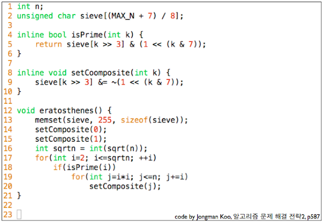

* [BOJ 2098 외판원 순회](http://acmicpc.net/problem/2098)

## 문제요약

$1$부터 $N$번까지 번호가 매겨져 있는 도시를$(2\leq{}N\leq{}16)$ 외판원이 어느 도시에서 출발하여 모든 도시를 전부 방문하고 다시 출발도시로 돌아올 때, 간선들의 최소합을 구하는 유명한 $NP-HARD$ 문제이다.

## 해법

$N$제한이 16이기 때문에, 전형적인 Bitmasking DP로 풀 수 있는 문제이다. 각 비트가 마을을 갔는지 안 갔는지로 생각하고 모든 경우를 다 해보면 된다. 


```cpp
#include <cstdio>
#include <cstring>
#include <algorithm>
#define mymin(a,b) (((a)<(b))?(a):(b))
int a[16][16];
int d[16][1<<16];
int main()  {
    int n;
    scanf("%d",&n);
    for ( int i = 0 ; i < n ; i++ )
        for ( int j = 0 ; j < n ; j++ )
            scanf("%d",&a[i][j]);
    for ( int i = 0 ; i < n ; i++ )
        for ( int j = 0 ; j < 1<<n ; j++ )
            d[i][j] = 100000000;
    d[0][1] = 0;
    for ( int i = 0 ; i < (1<<n) ; i++ )
        for ( int j = 0 ; j < n ; j++ )
            if ( i&(1<<j) )
                for ( int k = 0 ; k < n ; k++ )
                    if ( !(i&(1<<k)) )
                        if ( a[j][k] && d[k][i+(1<<k)] > d[j][i]+a[j][k] )
                            d[k][i+(1<<k)] = d[j][i] + a[j][k];
    int ans = 1000000000;
    for ( int i = 1 ; i < n ; i++ )
        ans = mymin(ans,d[i][(1<<n)-1] + a[i][0]);
    printf("%d",ans);
    return 0;
}
```

> 복습하는 의미로 bitmasking으로 할 수 있는 것을 생각해봤다.<br>
i번 째 비트 확인 : bit& (1<<i)<br>
i번 째 비트 1로 만들기 : bit |= (1<<i)<br>
i번 째 비트 0으로 만들기 : bit &= ~(1<<i)

