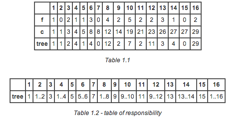
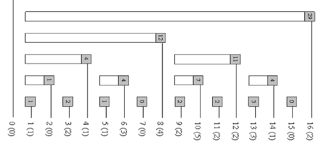

## Description

1994년에 Peter M. Fenwick이 고안한 자료구조로 구간에서 더하거나 빼는 등의 작업을 하고, 구간이 자주 업데이트 될 때 이용된다.

예를들어, $N$개의 박스가 있고 $Q$번의 쿼리가 있다고 해보자.
* $i$번 박스에 공을 집어 넣거나 뺌.
* $i$번째부터 $j$번째까지의 박스에 공이 총 몇 개 들었는지 알고싶음.

위 두 개의 쿼리를 처리하는데 아무런 자료구조를 쓰지 않는다면 <O(1), O($N*Q$)> 의 시간복잡도가 나온다. 여기서 RMQ 같은 자료구조를 이용하면 <O($log N$), O($Q * log N$)> 의 시간복잡도를 갖는다. 이 시간복잡도와 똑같은 효과를 낼 수 있지만 훨씬 코드가 간결하고, 메모리도 적게 먹는 자료구조가 Fenwick Tree이다.

maxVal : 최대 구간<br>
f[i] : 주어진 sequence $(1\leq{}i\leq{}maxVal)$<br>
c[i] : $\sum_{k=1}^{i}f[k]$<br>
tree[i] : r을 i의 마지막 bit라고 했을 때, $(i-2^r+1)$ 에서부터 $(i)$까지의 합.
* $\sum_{k=i-2^r+1}^{i}c[k]$<br>

위와 같이 정의 했을 때,<br><br>



이런식으로 테이블이 채워지게 된다. 이를 잘 눕히면



이런 모양으로 나타낼 수 있다. 이 때, c[13]을 tree[13]+tree[12]+tree[8]로 나타낼 수 있는는데, 이 숫자들을 전부 2진수로 바꿔보면 c[1101]=tree[1101]+tree[1100]+tree[1000]으로 나타낼 수 있다. 이를 통해 찾고자 하는 index에서 최하위 bit를 빼주며 값을 더해주면 tree가 주어졌을 때, c를 구할 수가 있다.

## 최하위 비트를 구하는 방법

&nbsp;num = $a1b$<br>
-num = $(a1b)^- + 1$ = $a^-0b^- + 1$<br>
&nbsp;&nbsp;&nbsp;&nbsp;&nbsp;&nbsp;&nbsp;&nbsp;&nbsp;&nbsp;&nbsp;
= $a^-0(0...0)^- + 1$ = $a^-0(1...1)+1$ = $a^-1(0...0)$ = $a^-1b$<br>

따라서 num과 -num을 and연산 해주면<br>

&nbsp;&nbsp;&nbsp;&nbsp;&nbsp;&nbsp;&nbsp;&nbsp;&nbsp;$a1b$<br>
& &nbsp;&nbsp;$a^- 1b$<br>
\-\-\-\-\-\-\-\-\-\-\-\-\-\-\-<br>
$(0..0)1(0..0)$<br>

이 되므로 최하위 비트를 찾을 수 있게 된다.

```cpp
namespace FenwickTree {
    typedef long long ll;
    int MAX;
    vector<ll> tree;
    void Init(int size) {
        MAX=size;
        tree.resize(MAX+1);
    }
    ll Read(int idx) {
        ll ret=0;
        while ( idx > 0 ) {
            ret += tree[idx];
            idx -= (idx & -idx);
        }
        return ret;
    }
    void Update(int idx,int val) {
        while ( idx < MAX ) {
            tree[idx] += val;
            idx += (idx & -idx);
        }
    }
}
/*
namespace FenwickTreeRangeUpdate {
    private void update(int left, int right, int by) {
        internalUpdate(left, by, -by * (left - 1));
        internalUpdate(right, -by, by * right);
    }
     
    private void internalUpdate(int at, int mul, int add) {
        while (at < dataMul.length) {
            dataMul[at] += mul;
            dataAdd[at] += add;
            at |= (at + 1);
        }
    }
     
    private int query(int at) {
        int mul = 0;
        int add = 0;
        int start = at;
        while (at >= 0) {
            mul += dataMul[at];
            add += dataAdd[at];
            at = (at & (at + 1)) - 1;
        }
        return mul * start + add;
    }
}
*/
```
