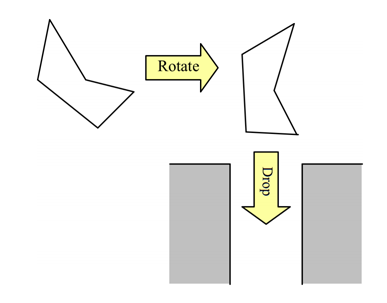

* [BOJ 4225 쓰레기 슈트](http://acmicpc.net/problem/4225)

## 문제요약

$N$개의 꼭지점으로 이루어진 다각형이 주어졌을 때$(1\leq{}N\leq{}100)$, 이 물체가 들어갈 수 있는 가장 작은 슈트의 너비를 구하는 문제이다.  $(0\leq{}X,Y\leq{}10^4)$



## 해법

이 문제를 잘 정의해 보면, 결국 슈트와 맞닿을 수 있는 볼록 다각형의 점들과 그 점들이 연결되어있는 선분들의 거리의 최대 거리 중, 최소값을 구하는 문제가 된다. 따라서 $Convex Hull$로 볼록 다각형의 점들을 구한 뒤, $O(N^2)$을 돌면서 모든 점과 선분을 비교하면 해결할 수 있다. 


```cpp
#include <cstdio>
#include <cmath>
#include <vector>
#include <algorithm>
using namespace std;
const double eps = 1e-9;
inline int diff(double lhs, double rhs) {
    if (lhs - eps < rhs && rhs < lhs + eps) return 0;
    return (lhs < rhs) ? -1 : 1;
}
struct Point {
    double x, y;
    Point() {}
    Point(double x_, double y_): x(x_), y(y_) {}
};
inline int ccw(const Point& a, const Point& b, const Point& c) {
    return diff(a.x * b.y + b.x * c.y + c.x * a.y
            - a.y * b.x - b.y * c.x - c.y * a.x, 0);
}
inline double dist2(const Point &a, const Point &b) {
    double dx = a.x - b.x;
    double dy = a.y - b.y;
    return dx * dx + dy * dy;
}
struct PointSorter {
    Point origin;
    PointSorter(const vector<Point>& points) {
        origin = points[0];
        for (int i = 1 ; i < points.size() ; i++) {
            int det = diff(origin.x, points[i].x);
            if (det > 0)
                origin = points[i];
            else if (det == 0 && diff(origin.y, points[i].y) > 0)
                origin = points[i];
        }
    }
    bool operator()(const Point &a, const Point &b) {
        if (diff(b.x, origin.x) == 0 && diff(b.y, origin.y) == 0) return false;
        if (diff(a.x, origin.x) == 0 && diff(a.y, origin.y) == 0) return true;
        int det = ccw(origin, a, b);
        if (det == 0) return dist2(a, origin) < dist2(b, origin);
        return det < 0;
    }
};
vector<Point> convex_hull(vector<point> points) {
    if (points.size() <= 3)
        return points;
    PointSorter cmp(points);
    sort(points.begin(), points.end(), cmp);
    vector<point> ans;
    ans.push_back(points[0]);
    ans.push_back(points[1]);
    for(int i = 2 ; i < points.size() ; i++) {
        while (ans.size() > 1 &&
                ccw(ans[ans.size() - 2], ans[ans.size() - 1], points[i]) >= 0)
            ans.pop_back();
        ans.push_back(points[i]);
    }
    return ans;
}
int main() {
    for ( int n,tc=1 ; scanf("%d",&n) == 1 && n ;tc++ ) {
        vector<point> v;
        for ( int i = 0 ; i < n ; i++ ) {
            double a,b;
            scanf("%lf%lf",&a,&b);
            v.push_back(Point(a,b));
        }
        vector<Point> convexV=convex_hull(v);
        double ans=65535;
        convexV.push_back(convexV[0]);
        for ( int i = 1 ; i < convexV.size() ; i++ ) {
            double now=0;
            for ( int j = 1  ; j < convexV.size() ; j++ ) {
                double dis;
                if ( i==j || i-1 ==j ) continue;
                if ( convexV[i].x == convexV[i-1].x )
                    dis = abs(convexV[i].x - convexV[j].x);
                else {
                    double m = (convexV[i].y-convexV[i-1].y)/(convexV[i].x-convexV[i-1].x);
                    double b = convexV[i-1].y-m*convexV[i-1].x;
                    dis = abs(m*convexV[j].x-convexV[j].y+b)/sqrt(m*m+1);
                }
                now = max(now,dis);
            }
            ans = min(ans,now);
        }
        printf("Case %d: %.2lf\n",tc,ans+0.005);
    }
    return 0;
}
```

> 졸립다.
