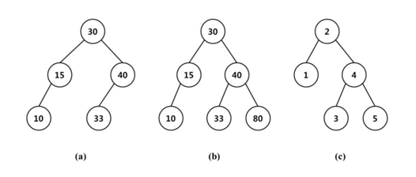

* [BOJ 8916 이진 검색 트리](http://acmicpc.net/problem/8916)

## 문제요약

이진 검색 트리란 부모 노드가 왼쪽 자식 노드보다 크고, 오른쪽 왼쪽 자식 노드보다 작은 트리를 말한다. 이진 검색 트리의 예로는 아래 그림을 들 수 있다. 



이 문제에서는 키가가 $1$~$N$인 노드를 가지고 있는 이진 검색 트리를 이용한다$(1\leq{}N\leq{}20)$. 이 때, $(2,1,4,3,5)$를 이진 검색 트리로 구성하면 $(C)$와 같은 트리가 되고, 마찬가지로 $(2,4,3,1,5)$를 이진 검색 트리로 구성해도 $(C)$와 같은 트리가 된다. 입력으로 이진 검색 트리가 주어졌을 때, 이 트리를 구성할 수 있는 모든 순열의 경우의 수를 구하는 문제이다.

## 해법

먼저 입력으로 들어온 순열로 이진 검색 트리를 구성한다. 이 때, 함께 구해야 하는 정보가 현재 노드의 자식의 개수이다. 위의 예제에서 보면 $(b)$의 30번 노드의 자식 개수는 6개(혹은 5개)가 된다. 이제 문제를 해결해야 하는데, $DP$로 해결할 수 있다. 리프 노드부터 시작해서 루트까지 올라오면서 현재 상태의 노드로 올 수 있는 경우의 수를 구하면 된다. 현재 상태의 노드는 결국 왼쪽 자식과 오른쪽 자식의 경우의 수와 현재 상태의 노드를 만드는 경우의 수를 이용하여 나타낼 수 있다. 모든 경우는 독립사건이므로 각각을 따로 구해서 곱해주면 구할 수 있다. 

따라서 리프 노드들을 구성하는 경우의 수는 1개이고, 그 외의 노드를 구성하는 경우의 수는 왼쪽 자식의 경우의수 $(d[leftChild])$와 오른쪽 자식의 경우의수 $(d[rightChild])$와 오른쪽 자식의 수에서 중복하여 왼쪽 자식의 수를 뽑는 경우를 곱해주면 된다.

$d[now]=d[leftChild]*d[rightChild]*_{rightChildSize}H_{leftChildSize}$ 이고,<br>
$_nH_r=_{(n+r-1)}C_r$ 로 나타낼 수 있으므로 <br>
$d[now]=d[leftChild]*d[rightChild]*_{nowChildSize-1}C_{leftChildSize}$ 이다.


```cpp
#include <cstdio>
#include <cstring>
#include <algorithm>
#include <vector>
using namespace std;
typedef pair<int,int> ii;
typedef long long ll;
const ll mod=9999991;
ll nCm[22][22];
int n,root,depth[22],d[22],childSize[22];
struct node{
    int l,r;
    node(){}
    node(int l,int r):
        l(l),r(r){}
};
vector<node> v;
void go2(int &root,int now) {
    if ( root == 0 ) {
        root = now;
        childSize[root] = 1;
        return ;
    }
    childSize[root]++;
    if ( root > now ) go2(v[root].l,now);
    else go2(v[root].r,now);
}
ll go(int now) {
    if ( now == 0 ) return 1ll;
    ll now1,now2;
    now1 = go(v[now].l);
    now2 = go(v[now].r);
    d[now] = (now1*now2*abs(nCm[childSize[now]-1][childSize[v[now].l]]))%mod;
    return d[now];
}
int main(){
    memset(nCm,-1,sizeof(nCm));
    for ( int i = 1 ; i < 22 ; i++ )
        nCm[i][0]=nCm[i][i]=1;
    for ( int i = 2 ; i < 22 ; i++ )
        for ( int j = 1 ; j < i ; j++ )
            nCm[i][j] = nCm[i-1][j-1]+nCm[i-1][j];
    int tc;
    scanf("%d",&tc);
    while ( tc-- ) {
        v.clear();
        scanf("%d",&n);
        v.resize(n+1);
        for ( int i = 0 ; i <= n ; i++ )
            v[i].l = v[i].r =childSize[i]= 0;
        root =0;
        for ( int i = 0 ; i < n ; i++ ) {
            int t;
            scanf("%d",&t);
            go2(root,t);
        }
        printf("%lld\n",go(root));
    }
    return 0;
}
```

> 테스트 케이스가 더 작은 똑같은 문제가 존재한다. 
> * [BOJ 8944 이진 검색 트리2](http://acmicpc.net/problem/8944)