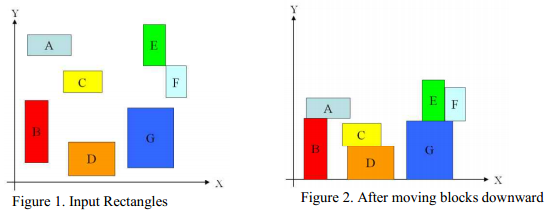
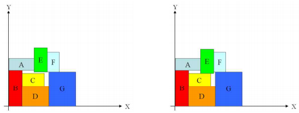
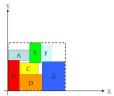

* [Live Archive 5839 Block Compaction](https://icpcarchive.ecs.baylor.edu/index.php?option=com_onlinejudge&Itemid=8&category=513&page=show_problem&problem=3850)

## 문제요약

제1사분면 위에 $N$개의 직사각형이 주어졌을 때$(1\leq{}N\leq{}500,1\leq{}x,y,p,q\leq{}100,000)$, 아래와 같은 작업을 할 수 있다. 

$Procedure$ $Compaction$<br>
$do$<br>
Step1. 모든 블럭을 아래로 내린다.<br>
Step2. 모든 블럭을 왼쪽으로 이동시킨다.<br>
$while(no$ $more$ $update)$

이 작업이 끝났을 때, 모든 직사각형을 덮는 최소의 직사각형의 너비와 높이를 구하는 문제이다.





## 해법

$N$제한이 500밖에 안되기 때문에, 모든 블럭들을 내리고 왼쪽으로 이동시켜보면서 더이상 이동을 하지 않을 때까지 돌리면 된다. 


```cpp
#include<cstdio>
#include<climits>
#include<cstring>
#include <vector>
#include<algorithm>
using namespace std;
  
struct point{
    int x,y,p,q;
    point(){}
    point(int x,int y,int p,int q):
    x(x),y(y),p(p),q(q){}
};
int T;
bool cmpX(const point& e1,const point& e2) {
    if ( e1.x != e2.x ) return e1.x<e2.x;
    return e1.y<e2.y;
}
bool cmpY(const point& e1,const point& e2) {
    if ( e1.y != e2.y ) return e1.y<e2.y;
    return e1.x<e2.x;
}
int main()
{
    for (scanf("%d", &T); T--;) {
        int n;
        scanf("%d",&n);
        vector<point> v;
        for ( int i = 0 ; i < n ; i++ ) {
            point t;
            scanf("%d%d%d%d",&t.x,&t.y,&t.p,&t.q);
            v.push_back(t);
        }
        bool ok=true;
        point ans(INT_MAX,INT_MAX,INT_MIN,INT_MIN);
        while ( ok ) {
            ok = false;
            sort(v.begin(),v.end(),cmpY);
            for ( int i = 0 ; i < n ; i++ ) {
                if ( !v[i].y ) continue;
                int now =0;
                for ( int j = 0 ; j < i ; j++ )
                    if ( ((v[j].x >= v[i].x && v[j].x < v[i].p) || (v[j].p >v[i].x && v[j].p <= v[i].p)) || (v[j].x <= v[i].x && v[j].p >= v[i].p)) 
                        now = max(now,v[j].q);
                if ( v[i].y == now ) continue;
                int diff=v[i].q-v[i].y;
                v[i].y = now;
                v[i].q = now+diff;
                ok = true;
            }
            sort(v.begin(),v.end(),cmpX);
            for ( int i = 0 ; i < n ; i++ ) {
                if ( !v[i].x ) continue;
                int now=0;
                for ( int j = 0 ; j < i ; j++ )
                    if ( ((v[j].y >= v[i].y && v[j].y < v[i].q) || (v[j].q > v[i].y && v[j].q <= v[i].q)) || (v[j].y <= v[i].y && v[j].q >= v[i].q) ) 
                        now = max(now,v[j].p);
                if ( v[i].x == now ) continue;
                int diff=v[i].p-v[i].x;
                v[i].x = now;
                v[i].p = now+diff;
                ok = true;
            }
        }
        for ( int i = 0 ; i < n ; i++ ) {
            ans.q = max(ans.q,v[i].q);
            ans.p = max(ans.p,v[i].p);
            ans.x = min(ans.x,v[i].x);
            ans.y = min(ans.y,v[i].y);
        }
        printf("%d %d\n",ans.p-ans.x,ans.q-ans.y);
  
    }
    return 0;
}
```

>말리기 딱 좋은 문제이다.
