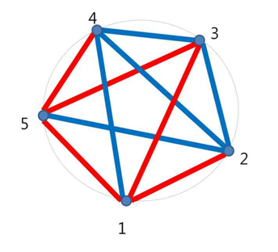

* [BOJ 8907 네온 사인](http://acmicpc.net/problem/8907)

## 문제요약

원에 $N$개의 꼭지점이 있고, $N*(N-1)$개의 빨간색과 파란색 두 종류의 간선으로 이루어져 있다. 이 때, 단색으로만 이루어진 삼각형의 개수를 세는 문제이다. 아래 그림에서는 $(1,3,5)$ $(2,3,4)$ 두 가지가 존재한다.




## 해법

단색 삼각형을 제외한 나머지 삼각형은 모두 정점에 연결되어 있는 변의 색이 다른 점이 두개, 같은 점이 한개가 나오므로 전체 경우의 수$N\choose{3}$$-sum(a[i]*b[i])/2$가 된다. 이 때, $a[i]$ 는 $edge[i][j]$가 0인 개수이고 $b[i]$는 $edge[i][j]$가 1인 개수이다.


```cpp
#include <cstdio>
#include <cstring>
#include <algorithm>
using namespace std;
 
int a[1111],b[1111];
int main() {
    int tc;
    scanf("%d",&tc);
    while ( tc-- ) {
        int n;
        scanf("%d",&n);
        memset(a,0,sizeof(a));
        memset(b,0,sizeof(b));
        for ( int i = 0 ; i < n ; i++ )
            for ( int j = i+1 ; j < n; j++ ) {
                int t;
                scanf("%d",&t);
                if ( !t ) a[i]++,a[j]++;
                else b[i]++,b[j]++;
            }
        int nC3=(n*(n-1)*(n-2))/6;
        int sum=0;
        for ( int i = 0 ; i < n ; i++ )
            sum+=a[i]*b[i];
        printf("%d\n",nC3-sum/2);
    }
 
    return 0;
}
```
