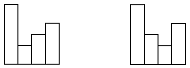

* [BOJ 1328 High-rise Building](http://acmicpc.net/problem/1328)

## 문제요약

$N$개의 높이가 다른 빌딩이 한 줄로 서있고, 이 빌딩들의 높이는 $1$보다 같거나 크고 $N$보다 같거나 작다$(1\leq{}l,r\leq{}N\leq{}20)$. 이 때, 왼쪽에서 봤을 때의 빌딩 개수와 오른쪽에서 봤을 때의 빌딩 개수가 주어졌을 때, 실제 빌딩의 가능한 배치의 경우의 수를 구하는 문제이다. 빌딩의 개수가 4개이고 왼쪽에서 본 빌딩의 수가 1, 오른쪽에서 본 빌딩의 수가 2개일 때, 배치 가능한 경우의 수는 아래 두 그림이 된다. 




## 해법

$3$차원 $DP$로 해결할 수 있다. 현재 상태를 $d[n][l][r]$이라고 해보자. 이 때, 현재 상태로 올 수 있는 경우를 세 가지로 나눌 수 있는데, 빌딩이 하나 없는 상태에서 새로운 빌딩을 왼쪽에다 추가하는 경우와 오른쪽에다 추가하는경우, 그리고 두 빌딩 사이에 추가하는 경우로 나눌 수가 있다. 좌 우는 간단하고 두 빌딩 사이에 추가하는 경우를 잘 생각해보면, 가장 왼쪽 빌딩과 가장 오른쪽 빌딩 사이에는 아무렇게나 집어넣을 수 있으므로, $N-1$개의 빌딩 중 가장 좌우 빌딩을 제외한 $N-2$만큼의 공간에 빌딩을 집어넣을 수 있다.

```cpp
#include <cstdio>
#include <cstring>
long long d[111][111][111];
#define mod 1000000007ll
long long go(int n, int l, int r){
    if(n<=0 || l<=0 ||r<=0) return 0;
    if(d[n][l][r]!=-1) return d[n][l][r];
    return d[n][l][r] = (go(n-1,l-1,r)
        + go(n-1,l,r-1)
        + go(n-1,l,r)*(n-2))%mod;
}
int main(){
    int n,l,r;
    scanf("%d %d %d",&n,&l,&r);
    memset(d,-1,sizeof(d));
    d[1][1][1] = 1;
    printf("%lld\n",go(n,l,r));
    return 0;
}
```

>힝 피곤을 무릅쓰고 오늘 업데이트.


