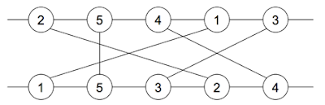
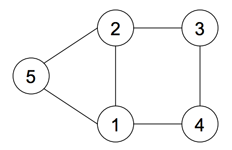

* [BOJ 9463 순열 그래프](http://acmicpc.net/problem/9463)

## 문제요약

$n$개의 순열 두 개가 주어진다$(1\leq{}n\leq{}100,000)$. 두 개의 평생선을 그리고 주어진 순열을 각각의 평행선에 올렸을 때, 같은 노드 번호를 가진 노드끼리 간선을 연결한다.



예를 들어, ${(2,5,4,1,3)}$, ${(1,5,3,2,4)}$ 의 순열로 그래프를 구성하면 위와 같은 그래프가 된다. 이 때, 겹치는 선분끼리를 그 노드들의 간선이라 보면 아래와 같은 새로운 그래프를 구성할 수 있다. 이 때, 간선의 총 개수를 구하는 문제이다.



## 해법

새로 만들어지는 간선의 개수는 각 노드끼리 겹치는 선분의 개수가 된다. 결국 새로 그래프를 구성할 필요없이 현재 그래프의 각 노드를 보면서 겹치는 선분의 개수만 새면 된다. 일반적으로 생각할 수 있는 $O(N^2)$방법을 이용하면 시간초과가 난다. 따라서 $Fenwick$ $Tree$같은 자료구조를 이용해서 각 노드를 돌면서 간선을 추가해준 다음 전체에서 이전까지의 간선 개수를 빼주면서 겹치는 선분을 세면 된다.

```cpp
#include <cstdio>
#include <cstring>
#include <vector>
#include <algorithm>
using namespace std;
typedef pair<int,int> ii;
typedef long long ll;
int tree[111111],pos[111111];
int N;
int read(int now) {
    int ret=0;
    while ( now > 0 ) {
        ret += tree[now];
        now -= now&-now;
    }
    return ret;
}
void update(int now,int value) {
    while ( now <= N ) {
        tree[now] += value;
        now += now&-now;
    }
}
int main() {
    int tc;
    scanf("%d",&tc);
    while ( tc-- ) {
        memset(tree,0,sizeof(tree));
        scanf("%d",&N);
        ii v[111111];
        for ( int i = 1 ; i <= N ; i++ ) {
            int t;
            scanf("%d",&t);
            v[i].first = pos[t] = i;
        }
        for ( int i = 1 ; i <= N ; i++ ) {
            int t;
            scanf("%d",&t);
            v[pos[t]].second = i;
        }
        sort(v+1,v+N+1);
        ll ans =0;
        for ( int i = 1 ; i <= N ; i++ ) {
            ans += read(N)-read(v[i].second);
            update(v[i].second,1);
        }
        printf("%lld\n",ans);
    }
    return 0;
}
```
