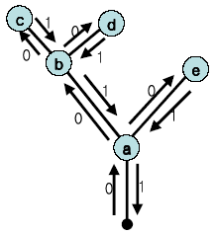
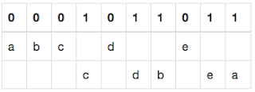

* [BOJ 2233 사과나무](http://acmicpc.net/problem/2233)

## 문제요약

$N$개의 정점이 있는 아래그림과 같은 트리가 있다. $(1\leq{}N\leq{}2,000)$ 



이런 사과나무를 $DFS$로 탐색하면서 자식노드로 넘어갈 땐 0, 더이상 갈 곳이 없어서 리턴하는 간선을 1이라고 했을 때, 길이가 $2*N$ 인 아래 그림과 같은 이진수 문자열이 생긴다. 



이 트리는 벌레가 지나다니면서 사과가 썩는 경우가 있는데, 사과가 썩을 수 있는 최대 개수는 2개이고 썩은 사과를 없애기 위한 작업은 사과자르는 일을 한 번 수행하는 것이다. 이 때, 멀쩡한 사과가 사라지는 개수를 최소로 하고 썩은사과를 전부 없앨 수 있는 사과를 찾는 것이다. 다시 말하면 썩은 사과의 가장 가까운 아빠 사과를 찾는 문제이다.

## 해법

일단 굉장히 당황스러웠던게, 이진수 문자열을 트리로 재구성을 해야할 지, 아니면 이진수 문자열 자체를 트리로 생각하여 구현할 지 많이 고민했다. 하지만 귀찮아서 트리로 구성했다. 구성할 때, 내가 알아야만 하는 정보는 각 위치가 어떤노드로 구성되어야 하는 것이므로 대충 $Coloring$을 했고 1을 만났을 때, 좌측의 방문하지 않은 노드중에서 0을 찾으면 된다. 

그렇게 트리를 구성하고, 가장 가까운 조상을 찾아야 한다. 썩은 사과들의 가장 좌측부분의 왼쪽에 0이 위치하고, 가장 우측부분의 오른쪽에 1이 위치하는 노드 중에서 같은 $Color$를 가진 노드들이 가장 가가운 조상이므로 그것들을 출력하면 된다. 찾고자하는 사과가 하나 뿐이라면 예외적으로 그 사과 하나만을 자르면 된다.


```cpp
#include <cstdio>
#include <cstring>
#include <algorithm>
#include <vector>
using namespace std;
int N;
char s[22222];
int tree[22222];
int main() {
    scanf("%d",&N);
    scanf("%s",s);
    int X,Y;
    scanf("%d%d",&X,&Y);
    X--,Y--;
    int color=1;
    vector<bool> vis(N*N,false);
    for ( int i = 0 ; s[i] ; i++ ) {
        if ( s[i] == '0' ) tree[i]=color++;
        else if ( s[i] == '1' ) {
            for ( int j = i-1 ; j >= 0 ; j-- )
                if ( s[j] == '0' && !vis[j] ) {
                    tree[i]=tree[j],vis[j]=vis[i]=true;
                    break;
                }
        }
    }
    int l=987654321,r=-1;
    for ( int i = 0 ; s[i] ; i++ )
        if ( tree[i]==tree[X] || tree[i]==tree[Y] )
            l = min(l,i),r = max(r,i);
    if ( tree[l]==tree[r] ) return printf("%d %d\n",l+1,r+1),0;
    for ( int i = l-1 ; i >= 0 ; i-- )
        for ( int j = r+1 ; s[j] ; j++ )
            if ( tree[i] == tree[j] )
                return printf("%d %d\n",i+1,j+1),0;
    return 0;
}
```

> 내 소스같은 경우, 대충 tree를 만들었기 때문에 
O($N^2$) 에 가까운 솔루션이 되었지만, tree를 구성할 때, 왼쪽 color와 오른쪽 color를 각각 mapping시켜놓으면 
O($N$)으로도 해결할 수 있을 것 같다.
