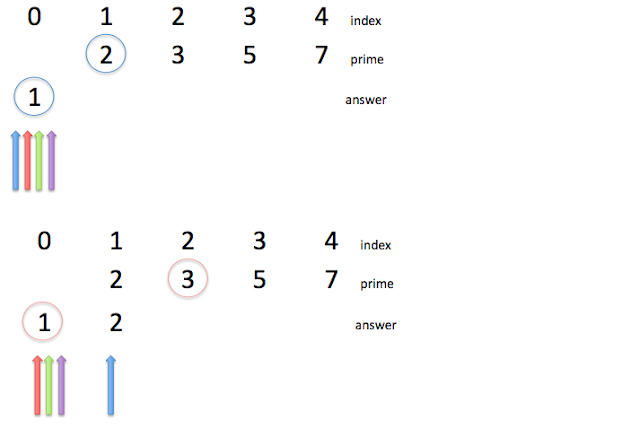
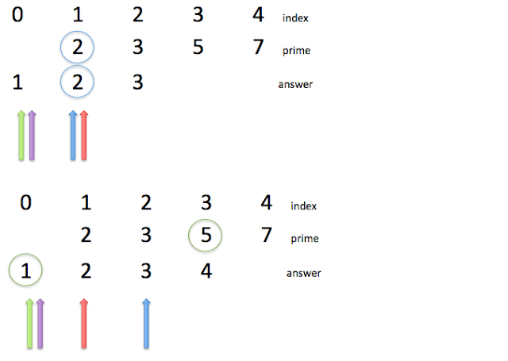
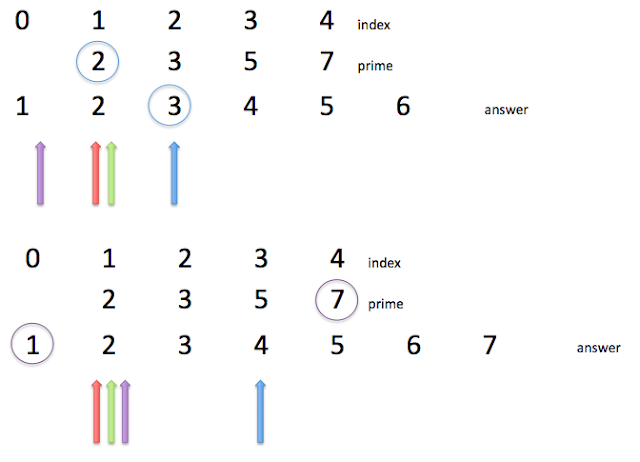

* [BOJ 2014 소수의 곱](http://acmicpc.net/problem/2014)

## 문제요약

K개의 소수가 주어지고$(1\leq{}K\leq{}100)$, 이 소수들을 곱해서 나온 소수를 $Prime_K$라 할 때, $Prime_K$ 중 N번째 소수를 구하는 문제이다$(1\leq{}N\leq{}100,000)$.

## 해법


주어진 소수들에게 어느 위치까지 곱한 상황인지를 나타내는 포인터를 두고 해결하면 된다. $K=4$이고 $2 3 5 7$인 경우를 예로 보면, 맨처음의 포인터들은 전부 1을 가르키고 있다. 이 때, $Prime_N$을 구해야 하므로 $Prime_i$의 값을 구하도록 한다$(1\leq{}i\leq{}N)$. 매 $Prime_i$의 값을 구하기 위해서는 모든 소수들과 $Prime_(pointer i)$의 곱 중에서 최소값을 구하면 그 값이 $Prime_i$의 값이 되고, 현재 가르키는 소수의 포인터를 하나 증가시켜 주면 구할 수 있다. 아래 그림 참조. 






```cpp
#include <cstdio>
#include <cstring>
int main() {
    int k,n;
    scanf("%d%d",&k,&n);
    int a[111]={};
    for ( int i = 0 ; i < k ; i++ )
        scanf("%d",&a[i]);
    int ans[111111]={};
    ans[0] = 1;
    int p[111]={};
    for ( int i = 1 ; i <= n ; ) {
        int min = 0x7FFFFFFF;
        int min_idx=0;
        for ( int j = 0 ;  j < k ; j++ )
            if ( ans[p[j]]*a[j] < min ) {
                min = ans[p[j]]*a[j];
                min_idx = j;
            }
        if ( min != ans[i-1] )
            ans[i++] = min;
        p[min_idx] ++;
    }
    printf("%d\n", ans[n]);
    return 0;
}
```

> 옛날 동규형이 설명해 준 문제.
