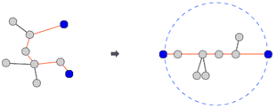
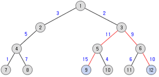

* [BOJ 1967 트리의 지름](http://acmicpc.net/problem/1967)
* [BOJ 1167 트리의 지름](http://acmicpc.net/problem/1167)

## 문제요약

$Tree$는 싸이클이 없는 무방향 그래프이다. 이 때, 트리의 $N$개의 정점 중에서 임의의 두 정점을 잡고 쫙 펼쳤을 때, 모든 노드가 잡고 펼친 두 정점을 지름으로 하는 원 안에 모두 존재하게 된다면 이 지름을 트리의 지름이라고 한다$(1\leq{}N\leq{}10,000)$. 



즉 잘 정리하면, 트리에 존재하는 모든 경로 중 가장 긴 경로가 트리의 지름이다. 가중치가 있는 트리가 주어질 때, 트리의 지름의 길이를 구하는 문제이다. 아래와 같은 예제에서는 45가 트리의 지름의 길이가 된다.




해법

먼저 $Root$노드에서 가장 먼 노드까지 $DFS$순회를 한다. 그리고 그 노드에서 다시한번 $DFS$를 돌았을 때, 가장 먼 노드까지의 경로가 트리의 지름이 된다. 이것이 되는 이유는 $Tree$의 특성 중에 "한 정점에서 다른 한 정점으로 가는 경로는 유일하게 존재한다."는 특성 때문에 가능하게 되는 것이다. 이 특성을 이용해서 트리의 중심도 구할 수 있는데, 트리의 중심이란 자신으로부터 가장 멀리 떨어진 노드와의 거리가 최소인 점을 뜻한다. 이 트리의 중심은 항상 트리의 지름 위에 있고, 그 중에서도 트리의 중심에 위치한다.  


```cpp
#include <cstdio>
#include <cstring>
#include <vector>
#include <algorithm>
using namespace std;
typedef pair<int,int> ii;
int n;
vector<vector<ii> > v;
vector<bool> vis;
int t,tSum;
void go(int now,int sum) {
    if ( sum > tSum ) tSum=sum,t = now;
    vis[now] = true;
    for ( int i = 0 ; i < v[now].size() ; i++ )
        if ( !vis[v[now][i].first] )
            go(v[now][i].first,sum+v[now][i].second);
}
int main() {
    scanf("%d",&n);
    v.resize(n+1);
    for ( int i = 0 ; i < n-1 ; i++ ) {
        int st,ed,cost;
        scanf("%d%d%d",&st,&ed,&cost);
        v[st].push_back(ii(ed,cost));
        v[ed].push_back(ii(st,cost));
    }
    vis.resize(n+1,false);
    tSum=-1;
    go(1,0);
    fill(vis.begin(),vis.end(),false);
    tSum=-1;
    go(t,0);
    printf("%d\n",tSum);
    return 0;
}
```
