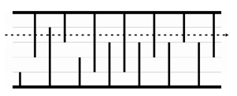

* [BOJ 3020 개똥벌레](http://acmicpc.net/problem/3020)

## 문제요약


길이가 $N$, 높이가 $H$ $(2\leq{}N\leq{}200,000,2\leq{}H\leq{}500,000)$인 아래 그림과 같이 생긴 동굴이 있고, 개똥벌레 한마리가 동굴의 시작점에서 끝점까지 일직선으로 날아간다. 이 때, 파괴되는 종유석과 석순의 개수의 최소값과 그러한 구간이 몇 개 있는지를 구하는 문제이다.

<br/>



## 해법

개똥벌레가 어느 높이에서 출발하는지만 정해진다면, 그 높이보다 높은 석순과 그 높이보다 낮은 종유석은 모두 부숴지게 된다. $H$ 제한이 $500,000$이기 때문에 모든 H에 대하여 돌면서 바이너리 서치로 부숴지는 종유석과 석순의 개수를 세주면 쉽게 풀 수 있다.

```cpp
#include <cstdio>
#include <algorithm>
using namespace std;
const int inf = 987654321;
int a[111111],b[111111];
int main() {
    int N,H;
    scanf("%d%d",&N,&H);
    for (int i = 0; i < N/2; i++)
        scanf("%d%d", &a[i], &b[i]);
    sort(a, a+N/2);sort(b, b+N/2);
  
    int ans1 = inf, ans2 = 0;
    for (int i = 1; i <= H; i++) {
        int cnt = N/2 - (lower_bound(a,a+N/2,i)-a);
        cnt += N/2 - (lower_bound(b,b+N/2,H-i+1)-b);
        if (cnt < ans1) ans2=1, ans1=cnt;
        else if (cnt == ans1) ans2++;
    }
    printf("%d %d\n",ans1, ans2);
    return 0;
}
```
