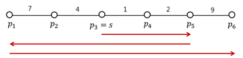

* [BOJ 4243 보안 업체](http://acmicpc.net/problem/4243)

## 문제요약

$N$개의 회사가 있고 현재 보안 업체의 직원이 s에 위치하며 회사와 옆회사와의 이동시간 $t[P_i,P_{i+1}]$ 가 주어져있다$(1\leq{}N\leq{}100,1\leq{}t[P_i,P_{i+1}]\leq{}15,000,000)$. 그리고 각 회사의 대기 시간 $l_i$는 보안 업체의 직원이 처음 방문하는 시간이다. 이 때, 대기시간 $l_i$의 총 합을 최소로 하는 문제이다.




## 해법

$d[100][100][2]$의 $DP$로 해결할 수 있다. $d[i][j][k]$라고 했을 때, $i$는 $left$ $j$는 $right$ $k$는 어느 위치에서 왔는지를 나타내주면 된다. $iterative$하게 짜면 말릴 수 있으므로 메모이제이션으로 쉽게 구현할 수 있다.


```cpp
#include <cstdio>
#include <cstring>
#include <algorithm>
using namespace std;
typedef long long ll;
const ll inf = 1ll<<62;
int N,S;
int a[111];
ll d[111][111][2],s[111];
ll go(int le,int ri,int where) {
    if ( le == 1 && ri == N ) return 0;
    ll& ret = d[le][ri][where];
    if ( ~ret ) return ret;
    where = where?ri:le;
    ret = inf;
    if ( le > 1 ) ret = min(ret,go(le-1,ri,0)+(s[where]-s[le-1])*(N-(ri-le+1)));
    if ( ri < N ) ret = min(ret,go(le,ri+1,1)+(s[ri+1]-s[where])*(N-(ri-le+1)));
    return ret;
}
int main() {
    int tc;
    scanf("%d",&tc);
    while ( tc-- ) {
        memset(d,-1,sizeof(d));
        memset(a,0,sizeof(a));
        memset(s,0,sizeof(s));
        scanf("%d%d",&N,&S);
        for ( int i =  2 ; i <= N ; i++ )
            scanf("%d",&a[i]);
        s[0] = a[0];
        for ( int i = 2 ; i <= N ; i++ )
            s[i] = s[i-1]+a[i];
        printf("%lld\n",go(S,S,0));
    }
    return 0;
}
```

>ㅜㅜ 대회 때에는 어려운 줄 알고 풀지 못했다.

