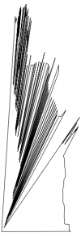

* [BOJ 3679 단순 다각형](http://acmicpc.net/problem/3679)

## 문제요약

주어진 $N$개의 점들을 모두 이용하여 다각형을 만드는 문제이다 $(3\leq{}N\leq{}2,000)$. 다각형의 두 선분은 연속하는 두 선분의 교점을 제외하고는 교차할 수 없다. 

## 해법

위 그림과 같이 각도순으로 정렬해서 이어주면 된다. 



```cpp
#include <cstdio>
#include <vector>
#include <algorithm>
#include <cstring>
#include <cmath>
using namespace std;
const double eps=1e-9;
struct point {
    int idx;double x,y,ang;
    point(){}
    point(int idx,double x,double y,double ang):
        idx(idx),x(x),y(y),ang(ang){}
};
bool cmp(const point& e1,const point &e2) {
    return e1.ang < e2.ang;
}
int main() {
    int tc;
    scanf("%d",&tc);
    while ( tc-- )  {
        int n;
        scanf("%d",&n);
        vector<point> v;
        double mx=0,my=0;
        for ( int i = 0 ; i < n ; i++ ) {
            double a,b;
            scanf("%lf%lf",&a,&b);
            v.push_back(point(i,a,b,0));
            mx += a/n; my += b/n;
        }
        for ( int i = 0 ; i < n ; i++ )
            v[i].ang = atan2(v[i].y-my+1.23e-7,v[i].x-mx+4.56e-7);
        sort(v.begin(),v.end(),cmp);
        for ( int i =0  ; i < n ; i++ )
            printf("%d ",v[i].idx);
        puts("");
        v.clear();
    }
    return 0;
}
```

>맨 처음에는 Convex Hull로 접근했었다 틀림. 될거같은데 ...

