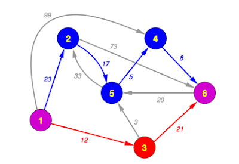

* [BOJ 3640 제독](http://acmicpc.net/problem/3640)

## 문제요약

방향성이 있는 E개의 뱃길이 주어지고$(3\leq{}E\leq{}10,000)$, 뱃길을 안전하게 이동할 수 있게 발사해야만 하는 포탄의 수가 주어질 때, 출발점에서 두 대의 배가 출발하여 도착점에 도착할 때까지 만나지 않으면서 발사하는 포탄의 최소값을 구하는 문제이다 $(3\leq{}V\leq{}1,000, 1\leq{}COST\leq{}100)$. 

## 해법

전형적인 $Min Cost Max Flow$문제이다. 그래프를 잘 구성하여 $MCMF$를 돌리면 된다. 


```cpp
#include <cstring>
#include <cstdio>
#include <queue>
#include <vector>
#include <algorithm>
#include <functional>
using namespace std;
struct edge {
    int target;
    int capacity; // cap_t
    int cost; // cost_t
    edge(){}
    edge(int target,int capacity,int cost):
        target(target),capacity(capacity),cost(cost){}
};
namespace mcmf
{
    typedef int cap_t; // capacity type
    typedef int cost_t; // cost type
    const int SIZE = 5000;
    const cap_t CAP_INF = 0x7fFFffFF;
    const cost_t COST_INF = 0x7fFFffFF;
    int n;
    vector<pair<edge, int> > g;
    int p[SIZE];
    cost_t dist[SIZE];
    cap_t mincap[SIZE];
    cost_t pi[SIZE];
    int pth[SIZE];
    int from[SIZE];
    bool v[SIZE];
    void init(const vector<edge> graph[], int size){
        int i, j;
        n = size;
        memset(p, -1, sizeof(p));
        g.clear();
        for (i = 0 ; i < size ; i++) {
            for (j = 0 ; j < graph[i].size() ; j++) {
                int next = graph[i][j].target;
                edge tmp = graph[i][j];
                g.push_back(make_pair(tmp, p[i]));
                p[i] = g.size() - 1;
                tmp.target = i;
                tmp.capacity = 0;
                tmp.cost = -tmp.cost;
                g.push_back(make_pair(tmp, p[next]));
                p[next] = g.size() - 1;
            } }
    }
    int dijkstra(int s, int t) {
        typedef pair<cost_t, int> pq_t;
        priority_queue<pq_t, vector<pq_t>, greater<pq_t> > pq;
        int i;
        for (i = 0 ; i < n ; i++) {
            dist[i] = COST_INF;
            mincap[i] = 0;
            v[i] = false;
        }
        dist[s] = 0;
        mincap[s] = CAP_INF;
        pq.push(make_pair(0, s));
        while (!pq.empty()) {
            int now = pq.top().second;
            pq.pop();
            if (v[now]) continue;
            v[now] = true;
            for (i = p[now] ; i != -1 ; i = g[i].second) {
                int next = g[i].first.target;
                if (v[next]) continue;
                if (g[i].first.capacity == 0) continue;
                cost_t pot = dist[now] + pi[now] - pi[next] + g[i].first.cost;
                if (dist[next] > pot) {
                    dist[next] = pot;
                    mincap[next] = min(mincap[now], g[i].first.capacity);
                    pth[next] = i;
                    from[next] = now;
                    pq.push(make_pair(dist[next], next));
                } }
        }
        for (i = 0 ; i < n ; i++) pi[i] += dist[i];
        return dist[t] != COST_INF;
    }
    pair<cap_t, cost_t> maximum_flow(int source, int sink) {
        memset(pi, 0, sizeof(pi));
        cap_t total_flow = 0;
        cost_t total_cost = 0;
        while (dijkstra(source, sink)) {
            cap_t f = mincap[sink];
            total_flow += f;
            for (int i = sink ; i != source ; i = from[i]) {
                g[pth[i]].first.capacity -= f;
                g[pth[i] ^ 1].first.capacity += f;
                total_cost += g[pth[i]].first.cost * f;
            } }
            return make_pair(total_flow, total_cost);
    }
} // namespace mcmf
int main() {
    int V,e;
    while ( scanf("%d%d",&V,&e) == 2 ) {
        vector<edge> v[5000];
        for ( int i = 0 ; i < e; i++ ) {
            int st,ed,cost;
            scanf("%d %d %d",&st,&ed,&cost);
            v[st*2+1].push_back(edge(ed*2,1,cost));
        }
        for ( int i = 2 ; i < V ; i++ )
            v[i*2].push_back(edge(i*2+1,1,0));
        v[2].push_back(edge(2+1,2,0));
        v[V*2].push_back(edge(V*2+1,2,0));
        v[1].push_back(edge(2,2,0));
        v[2*V+1].push_back(edge(2*V+1+1,2,0));
        mcmf::init(v,2*V+1+2);
        pair<int,int> ans=mcmf::maximum_flow(1,2*V+1+1);
        printf("%d\n",ans.second);
    }
    return 0;
}
```

> 두 함선(빨강, 파랑)은 1에서 시작해서 6에서 만난다. 빨간 함선은 1−>3−>6 (총 33개의 포탄)으로 이동하고, 파랑 함선은 1−>2−>5−>4−>6 (총 53개의 포탄)으로 이동한다.

