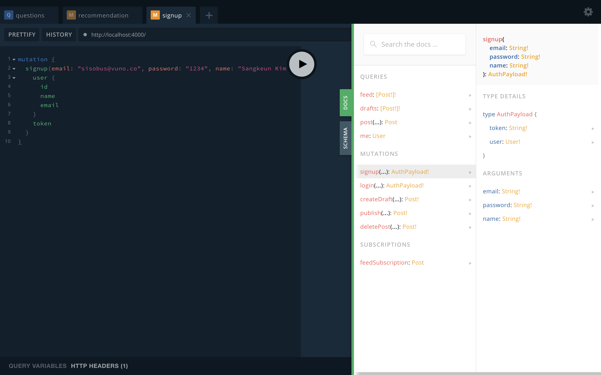
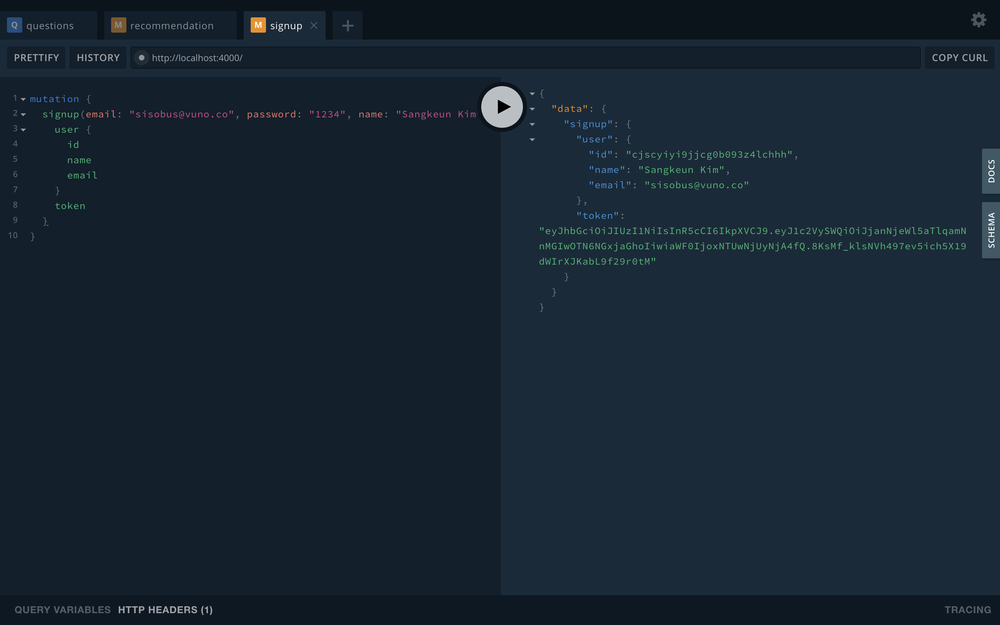
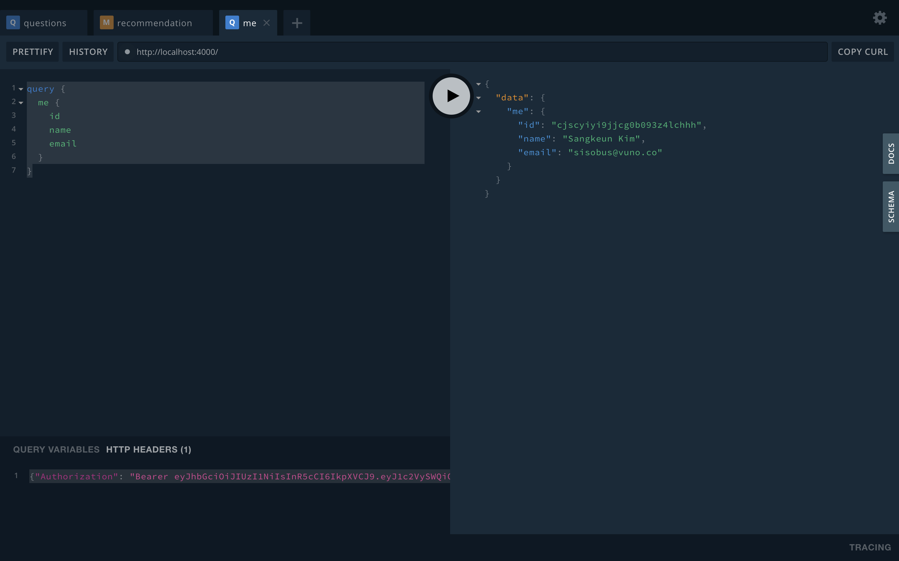

> 최근 사이드 프로젝트의 api를 GraphQL로 작성했는데, 이를 공유하고자 합니다.<br>
> 이 포스트에서는 Docker + Postgresql + GraphQL + Prisma + Nexus + Typescript를 이용해 인증처리를 포함한 API Server를 만듭니다.
> 내용은 [Repository](https://github.com/sisobus/graphql-typescript-server)에 있습니다.

* GraphQL Server (빠르게) 만들기-1
* **GraphQL Server (빠르게) 만들기-2**

## GraphQL boilerplate 사용하기

0. **yarn, docker, docker-compose는 설치되어 있다고 가정하겠습니다.**
1. graphql-cli 설치

```bash
$ yarn global add graphql-cli
```

2. graphql-typescript boilerplate 생성<br>
    * graphql create를 하면 프로젝트 디렉토리 이름을 쓰라고 합니다. (전 server라고 했습니다.)
    * 그러면 boilerplate를 선택하라고 하는데, 방향키로 내려서 typescript-advanced를 선택합니다.
    * 여기에 authentication도 포함되어있습니다.

```bash
$ graphql create
? Directory for new GraphQL project server
? Choose GraphQL boilerplate project: typescript-advanced
    GraphQL server (incl. database & authentication)
```

3. 실행 시켜보기
    * 브라우저에 localhost:4000을 치면 접속할 수 있습니다.
    * 이 화면이 GraphiQL입니다. (Playground)

```bash
$ cd server
$ yarn start
```



4. signup mutation 요청해보기
    * 오른쪽에 DOCS를 열어보면 현재 정의되어진 Schema를 볼 수 있고, mutations에 signup을 보면 argument로 email, password, name을 받아서 AuthPayload를 반환한다는 것을 알 수 있습니다.
    * 왼쪽에 다음 Query문을 쳐서 실행을 해봅시다.

```graphql
mutation {
  signup(email: "sisobus1@gmail.com", password: "1234", name: "Sangkeun Kim") {
    user {
      id
      name
      email
    }
    token
  }
}
```



5. me query 요청해보기
    * 왼쪽 아래에 있는 HTTP HEADERS에 `{"Authorization": "Bearer <token>"}` 를 써주고
    * 다음 Query문을 쳐서 실행을 해봅시다.

```graphql
query {
  me {
    id
    name
    email
    }
}
```




## 분석

server/prisma/prisma.yml 을 열어보면 endpoint에 https://us1.prisma.sh/public-nimblekiller-555/server/dev 이런 url을 볼 수 있습니다. 아~ 지금 데이터 모델링, 스키마정의 아무것도 하지 않았는데 GraphQL Server가 잘 되는 것이 저 외부 URL로 Query를 날리고, 그 결과를 응답해주는 것이구나~임을 알 수 있습니다. 

**prisma**는 datamodel.prisma에 정의된 모델에 맞추어 **자동으로 schema를 생성**해주는 아주 편리한 툴입니다. 다음 줄에는 datamodel: datamodel.prisma 라고 쓰여있는데, server/prisma/datamodel.prisma가 있는 것을 확인할 수 있고, 아~저기에 모델을 정의하면 되는구나~라는 것도 알 수 있습니다. server/prisma/datamodel.prisma에서 맨 밑에 다음 모델을 추가하고, 

```graphql
type Post {
  id: ID! @unique
  createdAt: DateTime!
  updatedAt: DateTime!
  published: Boolean! @default(value: "false")
  title: String!
  content: String!
  author: User!
}

type User {
  id: ID! @unique
  email: String! @unique
  password: String!
  name: String!
  posts: [Post!]!
}

type Test {
  id: ID! @unique
  field: String!
  createdAt: DateTime!
}
```

server/prisma에서

```bash
$ prisma deploy
```

를 실행하면 다음과 같이 server/src/generated/prisma-client가 생성되었음을 알 수 있습니다.

```bash
$ prisma deploy
Deploying service `server` to stage `dev` to server `prisma-us1` 2.9s

Changes:

  Test (Type)
  + Created type `Test`
  + Created field `id` of type `ID!`
  + Created field `field` of type `String!`
  + Created field `createdAt` of type `DateTime!`
  + Created field `updatedAt` of type `DateTime!`

Applying changes 1.1s

post-deploy:

Generating schema... 26ms

Running prisma generate...
Saving Prisma Client (TypeScript) at /Users/sisobus/coding/graphql-typescript-server/server/src/generated/prisma-client
Running prisma generate ✔

Your Prisma GraphQL database endpoint is live:

  HTTP:  https://us1.prisma.sh/public-nimblekiller-555/server/dev
  WS:    wss://us1.prisma.sh/public-nimblekiller-555/server/dev
```

server/src/generated/prisma-client/prisma-client.ts를 열어보면 조금 전에 작성한 type Test {} 에 해당하는 스키마가 생성되었음을 알 수 있습니다.

```typescript
type Mutation {
  ...
  createTest(data: TestCreateInput!): Test!
  updateTest(data: TestUpdateInput!, where: TestWhereUniqueInput!): Test
  updateManyTests(data: TestUpdateManyMutationInput!, where: TestWhereInput): BatchPayload!
  upsertTest(where: TestWhereUniqueInput!, create: TestCreateInput!, update: TestUpdateInput!): Test!
  deleteTest(where: TestWhereUniqueInput!): Test
  deleteManyTests(where: TestWhereInput): BatchPayload!
  ...
}

type Query {
  ...
  test(where: TestWhereUniqueInput!): Test
  tests(where: TestWhereInput, orderBy: TestOrderByInput, skip: Int, after: String, before: String, first: Int, last: Int): [Test]!
  testsConnection(where: TestWhereInput, orderBy: TestOrderByInput, skip: Int, after: String, before: String, first: Int, last: Int): TestConnection!
}

type Subscription {
  ...
  test(where: TestSubscriptionWhereInput): TestSubscriptionPayload
  ...
}

type Test {
  id: ID!
  field: String!
  createdAt: DateTime!
}

type TestConnection {
  pageInfo: PageInfo!
  edges: [TestEdge]!
  aggregate: AggregateTest!
}

input TestCreateInput {
  field: String!
}

type TestEdge {
  node: Test!
  cursor: String!
}

enum TestOrderByInput {
  id_ASC
  id_DESC
  field_ASC
  field_DESC
  createdAt_ASC
  createdAt_DESC
  updatedAt_ASC
  updatedAt_DESC
}
```

생각보다 너무 길어서 다음편으로 넘기겠습니다🙉🙉 다음편에서는 docker로 postgresql을 켜서 local database를 이용하고, prisma server도 docker로 켜서 우리의 endpoint를 local prisma server로 바꿔보겠습니다. 🤗🤗


