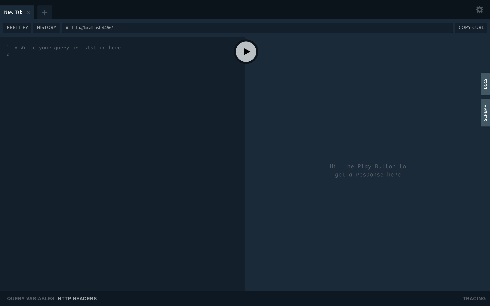
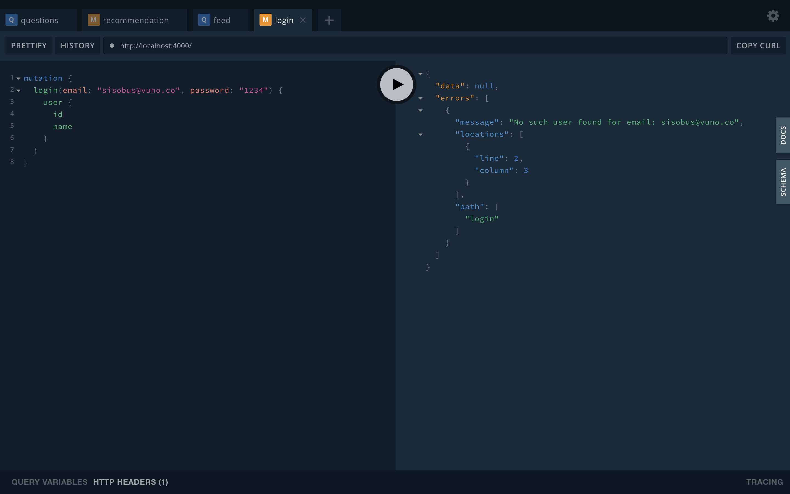

> 최근 사이드 프로젝트의 api를 GraphQL로 작성했는데, 이를 공유하고자 합니다.<br>
> 이 포스트에서는 Docker + Postgresql + GraphQL + Prisma + Nexus + Typescript를 이용해 인증처리를 포함한 API Server를 만듭니다.
> 내용은 [Repository](https://github.com/sisobus/graphql-typescript-server)에 있습니다.

* GraphQL Server (빠르게) 만들기-1
* GraphQL Server (빠르게) 만들기-2
* **GraphQL Server (빠르게) 만들기-3**
* GraphQL Server (빠르게) 만들기-4

<br>
이번 포스트에서는 Docker와 Docker-compose를 이용해 (Local)Prisma server와 PostgresQL을 띄워볼거에요.🙏🙏 그리고 endpoint를 (Local)Prisma server로 바꿀 예정입니다.

## Postgresql & Local prisma server 띄우기

1. 먼저 프로젝트 루트 디렉토리(/)에 docker-compose.yml을 만들어줍니다.

```yaml
version: "2.0"
services:
  prisma:
    image: prismagraphql/prisma:1.25
    restart: always
    ports:
    - "4466:4466"
    environment:
      PRISMA_CONFIG: |
        port: 4466
        databases:
          default:
            connector: postgres
            host: host.docker.internal
            database: prisma
            port: 5432
            user: prisma
            password: prisma
            migrations: true
    volumes_from:
      - postgres
    depends_on:
      - postgres

  postgres:
    restart: always
    image: postgres:latest
    environment:
      POSTGRES_USER: prisma
      POSTGRES_PASSWORD: prisma
    volumes:
      - ./data:/var/lib/postgresql/data
    ports:
      - "5432:5432"

volumes:
  postgres:
```

2. docker-compose로 실행시켜 줍니다.

```bash
$ docker-compose up -d
```

3. localhost:4466으로 접속하면 잘 켜지는걸 확인할 수 있습니다.




## GraphQL server와 Local prisma server로 연결하기

1. server/prisma/prisma.yml 수정
    * endpoint를 http://localhost:4466으로 변경해줍니다.
    * seed data는 필요없으므로 주석처리 해줍니다.

```yaml
# Specifies the HTTP endpoint of your Prisma API (deployed to a Prisma Demo server).
endpoint: http://localhost:4466

# Defines your models, each model is mapped to the database as a table.
datamodel: datamodel.prisma

# Specifies the language and directory for the generated Prisma client.
generate:
  - generator: typescript-client
    output: ../src/generated/prisma-client

# Seed your service with initial data based on `seed.graphql`.
#seed:
#  import: seed.graphql

# Ensures Prisma client is re-generated after a datamodel change.
hooks:
  post-deploy:
    - prisma generate

# If specified, the `secret` must be used to generate a JWT which is attached
# to the `Authorization` header of HTTP requests made against the Prisma API.
# Info: https://www.prisma.io/docs/reference/prisma-api/concepts-utee3eiquo#authentication
# secret: ${env:PRISMA_SECRET}
```

2. 모델에 따른 스키마 생성
    * server/prisma 위치에서 `prisma deploy`를 실행해줍니다.

```bash
$ prisma deploy
Deploying service `default` to stage `default` to server `local` 387ms

Changes:

  Post (Type)
  + Created type `Post`
  + Created field `id` of type `ID!`
  + Created field `createdAt` of type `DateTime!`
  + Created field `updatedAt` of type `DateTime!`
  + Created field `published` of type `Boolean!`
  + Created field `title` of type `String!`
  + Created field `content` of type `String!`
  + Created field `author` of type `User!`

  User (Type)
  + Created type `User`
  + Created field `id` of type `ID!`
  + Created field `email` of type `String!`
  + Created field `password` of type `String!`
  + Created field `name` of type `String!`
  + Created field `posts` of type `[Post!]!`
  + Created field `updatedAt` of type `DateTime!`
  + Created field `createdAt` of type `DateTime!`

  Test (Type)
  + Created type `Test`
  + Created field `id` of type `ID!`
  + Created field `field` of type `String!`
  + Created field `createdAt` of type `DateTime!`
  + Created field `updatedAt` of type `DateTime!`

  PostToUser (Relation)
  + Created relation between Post and Post

Applying changes 1.2s

post-deploy:

Generating schema... 38ms

Running prisma generate...
Saving Prisma Client (TypeScript) at /Users/sisobus/coding/graphql-typescript-server/server/src/generated/prisma-client
Running prisma generate ✔

Your Prisma GraphQL database endpoint is live:

  HTTP:  http://localhost:4466
  WS:    ws://localhost:4466
```

3. GraphQL server 실행(`yarn start`)해서 localhost:4000으로 확인해봅니다.
    * 변한건 없어보이지만, 전편에서 회원가입했던 아이디로 로그인을 하면 접속이 안되는 것을 볼 수 있습니다.
    * Endpoint를 localhost:4466으로 변경시켜줬기 때문에 prisma에서 제공해주던 서버가 아닌 조금전에 설정한 Local prisma server로 날린 요청이기 때문입니다.
    * 이제부터 데이터를 변경해도 /data에 저장이 되기 때문에, prisma server, postgresql, graphql server를 다 껏다 켜도 데이터는 남아있습니다. 성공!




### 완성!

여기까지만 하면 딱 **starter의 느낌으로 사용할 graphql server**가 만들어집니다. 이제부턴 datamodel을 수정하고 resolver를 만들어 본인만의 api를 작성하면 됩니다.

다음 포스트에는 nexus-prisma를 적용해 인증처리까지 만들어 볼 생각입니다. 🤗🤗🤗🤗


## +추가(안하고 넘어가도 됩니다.)

혹시 docker 로그 중에 `Warning: Management API authentication is disabled. To protect your management server you should provide one (not both) of the environment variables 'CLUSTER_PUBLIC_KEY' (asymmetric, deprecated soon) or 'PRISMA_MANAGEMENT_API_JWT_SECRET' (symmetric JWT)` 이런 경고가 뜨는게 거슬린다면

1. docker-compose.yml에 `managementApiSecret: thisismysecretapikey` 를 추가해준 뒤 새로 실행해준 다음,

```yaml
environment:
  PRISMA_CONFIG: |
    port: 4466
    managementApiSecret: thisismysecretapikey 
    databases:
      default:
        connector: postgres
        host: host.docker.internal
        database: prisma
        port: 5432
        user: prisma
        password: prisma
        migrations: true
```

2. 앞으로 prisma deploy 대신 `PRISMA_MANAGEMENT_API_SECRET=thisismysecretapikey prisma deploy` 로 실행해주면 됩니다.

