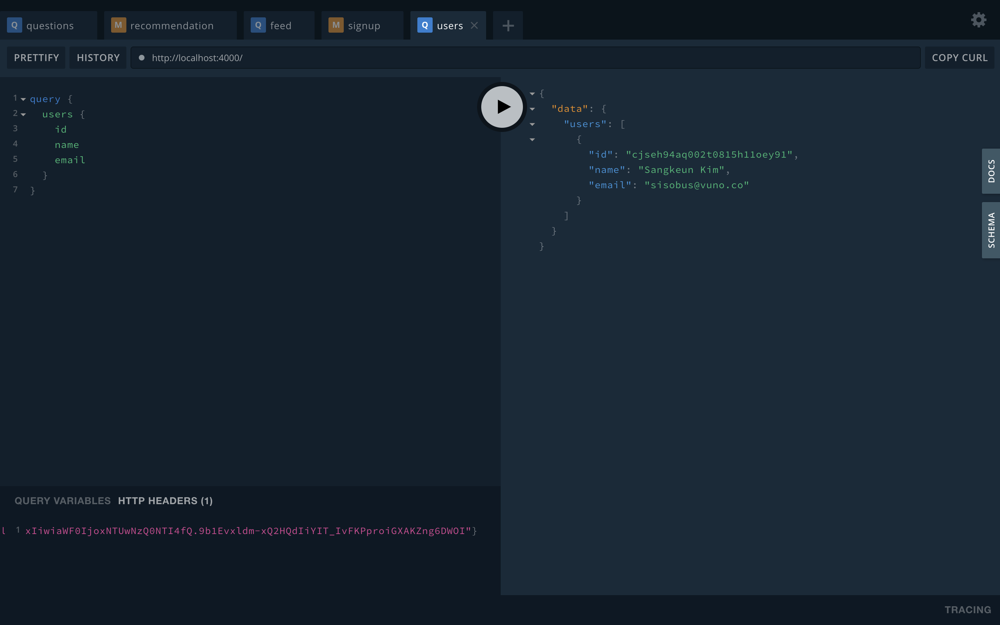
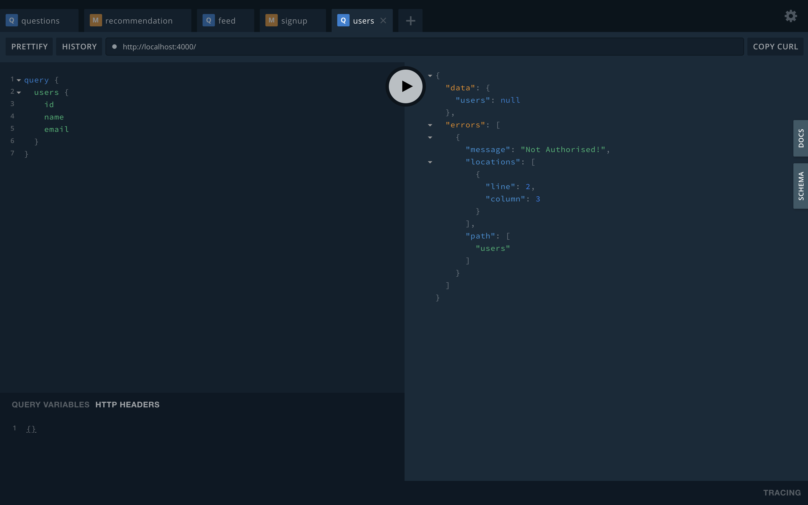

> 최근 사이드 프로젝트의 api를 GraphQL로 작성했는데, 이를 공유하고자 합니다.<br>
> 이 포스트에서는 Docker + Postgresql + GraphQL + Prisma + Nexus + Typescript를 이용해 인증처리를 포함한 API Server를 만듭니다.
> 내용은 [Repository](https://github.com/sisobus/graphql-typescript-server)에 있습니다.

* GraphQL Server (빠르게) 만들기-1
* GraphQL Server (빠르게) 만들기-2
* GraphQL Server (빠르게) 만들기-3
* **GraphQL Server (빠르게) 만들기-4**

## nexus-prisma 적용하기

1. 설치

```bash
$ yarn add --dev nexus-prisma nexus prisma-client-lib bcrypt
```

2. prisma가 deploy할 때 실행할 hook에 추가
    * server/prisma/prisma.yml

```yaml
hooks:
  post-deploy:
    - prisma generate
    - npx nexus-prisma-generate --client ./src/generated/prisma-client --output ./src/generated/nexus-prisma
```

3. prisma deploy 하기

```bash
$ prisma deploy
Deploying service `default` to stage `default` to server `local` 205ms
Service is already up to date.

post-deploy:

Generating schema... 34ms

Running prisma generate...
Saving Prisma Client (TypeScript) at /Users/sisobus/coding/graphql-typescript-server/server/src/generated/prisma-client
Running prisma generate ✔
npx: 85개의 패키지를 3.63초만에 설치했습니다.

Running npx nexus-prisma-generate --client ./src/generated/prisma-client --output ./src/generated/nexus-prisma...
Running npx nexus-prisma-generate --client ./src/generated/prisma-client --output ./src/generated/nexus-prisma ✔
```

4. 기존 코드는 prisma만을 적용하는 코드여서 많은 코드들을 nexus-prisma로 수정작업을 해줘야합니다.
    * [Repository](https://github.com/sisobus/graphql-typescript-server)의 브랜치중 3\_nexus\_prisma branch의 server/src/resolvers, server/src/index.ts 이 두친구들을 여러분 것과 대치시키는 것도 한 방법입니다.

    
**server/src/index.ts**

```ts
import { GraphQLServer } from 'graphql-yoga'
import { makePrismaSchema } from 'nexus-prisma'
import * as path from 'path'
import datamodelInfo from './generated/nexus-prisma'
import { prisma } from './generated/prisma-client'
import * as allTypes from './resolvers'

const schema = makePrismaSchema({
  // Provide all the GraphQL types we've implemented
  types: allTypes,

  // Configure the interface to Prisma
  prisma: {
    client: prisma,
    datamodelInfo,
  },

  // Specify where Nexus should put the generated files
  outputs: {
    schema: path.join(__dirname, './generated/schema.graphql'),
    typegen: path.join(__dirname, './generated/nexus.ts'),
  },

  // Configure nullability of input arguments: All arguments are non-nullable by default
  nonNullDefaults: {
    input: false,
    output: false,
  },

  // Configure automatic type resolution for the TS representations of the associated types
  typegenAutoConfig: {
    contextType: 'utils.Context',
    sources: [
      {
        alias: 'utils',
        source: path.join(__dirname, './utils.ts'),
      },
    ],
  },
})

const server = new GraphQLServer({
  context: request => ({
    ...request,
    prisma,
  }),
  schema,
})
server.start(() => console.log(`Server is running on http://localhost:4000`))
```

**server/src/resolvers/index.ts**

```ts
import { AuthPayload, User } from './models'
import { Mutation } from './Mutation'
import { Query } from './Query'

export const resolvers = {
  AuthPayload,
  Mutation,
  Query,
  User,
}
```

**server/src/resolvers/Query.ts**

```ts
import { queryType } from 'nexus'
import {
  me,
  user,
  users,
} from './queries'

export const Query = queryType({
  definition(t) {
    t.field('me', me)
    t.field('user', user)
    t.list.field('users', users)
  },
})
```

**server/src/resolvers/Mutation.ts**

```ts
import { mutationType } from 'nexus'
import {
  login,
  signup,
} from './mutations'

export const Mutation = mutationType({
  definition(t) {
    t.field('signup', signup)
    t.field('login', login)
  },
})
```

**server/src/resolvers/models/index.ts**

```ts
export * from './AuthPayload'
export * from './User'
```

**server/src/resolvers/models/User.ts**

```ts
import { prismaObjectType } from 'nexus-prisma'

export const User = prismaObjectType({
  name: 'User',
  definition(t) {
    t.prismaFields([
      'id',
      'name',
      'email',
    ])
  },
})
```

**server/src/resolvers/models/AuthPayload.ts**

```ts
import { objectType } from 'nexus'

export const AuthPayload = objectType({
  name: 'AuthPayload',
  definition(t) {
    t.string('token')
    t.field('user', { type: 'User' })
  },
})
```

**server/src/resolvers/mutations/index.ts**

```ts
export * from "./Auth"
```

**server/src/resolvers/mutations/Auth.ts**

```ts
import { compare, hash } from 'bcrypt'
import { sign } from 'jsonwebtoken'
import { idArg, intArg, stringArg } from 'nexus'

export const signup = {
  args: {
    email: stringArg(),
    level: intArg(),
    name: stringArg({ nullable: true }),
    password: stringArg(),
  },
  resolve: async (parent, { name, email, password, level }, ctx) => {
    const hashedPassword = await hash(password, 10)
    const user = await ctx.prisma.createUser({
      email,
      level,
      name,
      password: hashedPassword,
    })
    return {
      token: sign({ userId: user.id }, process.env.APP_SECRET),
      user,
    }
  },
  type: 'AuthPayload',
}

export const login = {
  args: {
    email: stringArg(),
    password: stringArg(),
  },
  resolve: async (parent, { email, password }, context) => {
    const user = await context.prisma.user({ email })
    if (!user) {
      throw new Error(`No user found for email: ${email}`)
    }
    const passwordValid = await compare(password, user.password)
    if (!passwordValid) {
      throw new Error('Invalid password')
    }
    return {
      token: sign({ userId: user.id }, process.env.APP_SECRET),
      user,
    }
  },
  type: 'AuthPayload',
}

export const deleteUser = {
  args: {
    id: idArg(),
  },
  resolve: async (parent, { id }, ctx) => {
    return await ctx.prisma.deleteUser({ id })
  },
  type: 'User',
}
```

**server/src/resolvers/queries/index.ts**

```ts
export * from './User'
```

**server/src/resolvers/queries/User.ts**

```ts
import { idArg, stringArg } from 'nexus'
import { getUserId } from '../../utils'

export const me = {
  resolve: async (parent, args, ctx) => {
    const userId = getUserId(ctx)
    return await ctx.prisma.user({ id: userId })
  },
  type: 'User',
}

export const users = {
  resolve: async (parent, args, ctx) => {
    return await ctx.prisma.users()
  },
  type: 'User',
}

export const user = {
  args: {
    id: idArg(),
  },
  resolve: async (parent, { id }, ctx) => {
    return await ctx.prisma.user({ id })
  },
  type: 'User',
}
```

5. signup, login, me, users 등의 query가 잘 먹는 것을 볼 수 있습니다.



6. 이제 GraphQLServer의 middleware에 권한을 추가해봅시다.
    * 여기 middleware 설명
    * 먼저 graphql-shield를 설치해줍니다.
    * src/permissions 디렉토리를 만들고, 그 안에 index.ts를 추가해줍니다.
    * 그리고 src/index.ts에 다음 두줄을 추가해줍니다.

```bash
$ yarn add graphql-shield
```

**src/permissions/index.ts**

```ts
import { rule, shield } from 'graphql-shield'
import { getUserId } from '../utils'

const rules = {
  isAuthenticatedUser: rule()((parent, args, context) => {
    const userId = getUserId(context)
    return Boolean(userId)
  }),
}

export const permissions = shield({
  Mutation: {
  },
  Query: {
    me: rules.isAuthenticatedUser,
    user: rules.isAuthenticatedUser,
    users: rules.isAuthenticatedUser,
  },
})
```

**src/index.ts**

```ts
...
import { prisma } from './generated/prisma-client'
import { permissions } from './permissions' // here
import * as allTypes from './resolvers'
...

const server = new GraphQLServer({
  context: request => {
    return {
      ...request,
      prisma,
    }
  },
  middlewares: [permissions], // here
  schema,
})
```

7. 이제 header에 Authorization을 빼고 users query를 요청하면 Not Authorised가 반환되는 것을 볼 수 있습니다.




이러면 nexus-prisma까지 적용하고, query에 인증된 사용자인지 처리하는 것까지 완성했습니다. 퇴근해야해서 여기까지만 쓰고 내일 살을 붙이겠습니다. 🙈🙈

